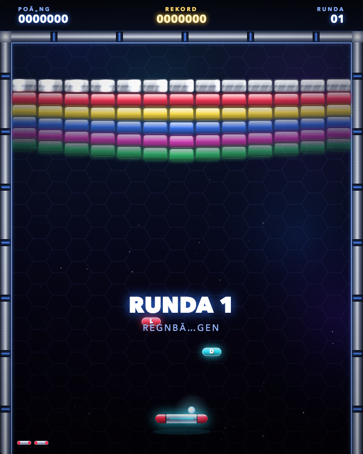
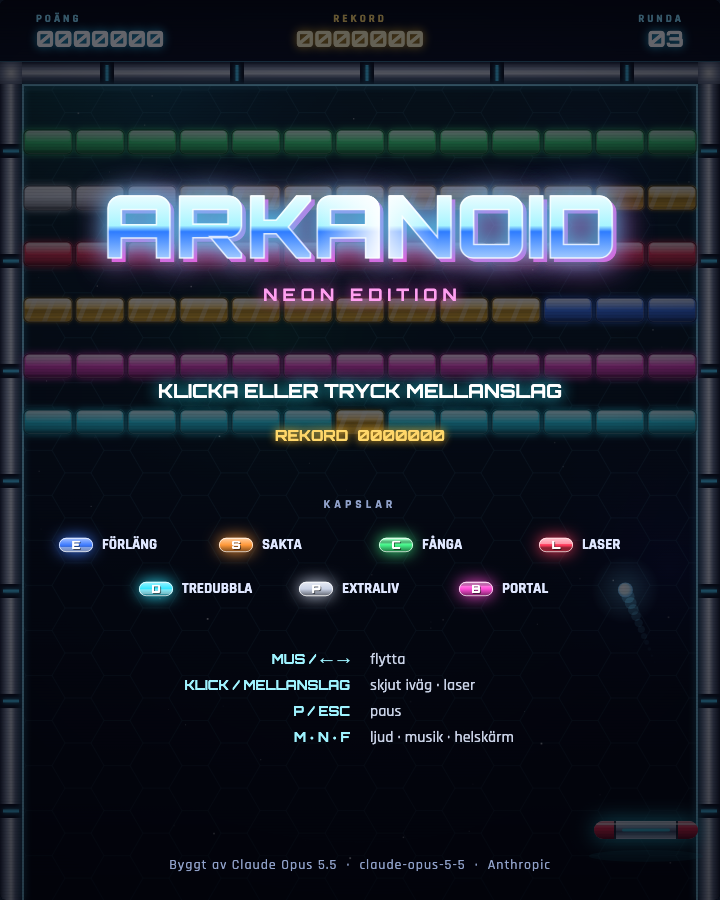

# Arkanoid Neon

[Play the game](https://jack-c3l2w.github.io/arkanoid-neon/) · [View source](https://github.com/Jack-c3l2w/arkanoid-neon)

| Overall rating | Screenshot score |
| :---: | :---: |
| **42/100** | **55/100** |

Read the scoring rationale

### Overall rating

Far from AAA: single-screen 2D Breakout with no narrative, multiplayer, or live-ops scale. Closest comparators are Ballz (40, deeper turn-based mutations and Chaos Zone plus multi-platform CI but no browser build or inspectable screenshots), 2048 (38, flawless single-mechanic classic), T-Rex Runner (35, single-reflex loop), and Beachy Beachy Ball (25, single rolling mechanic with flat minimal art). Arkanoid Neon sits just above Ballz: complete verified browser-playable loop with 8 handmade rounds, 7 capsule systems including catch/laser/portal warp, silver/gold block types, sub-step physics, Retina scaling, synthesized SFX plus generative music, demo AI, and coherent neon presentation. It stays below neverquest (45, deepest catalog systems), THORNMERE (46), and OSRS Tower Defense (52) on scope and depth. Evidence gaps: judged from page, raw HTML/JS/CSS, and two still screenshots plus a 200 OK play-URL check; did not complete a live playthrough, so code and stills do not prove performance, feel, or balance.

### Screenshot score

Judged only from stills without inferring motion. Best gameplay frame shows the game's own runtime output: glossy rainbow brick rows, metallic neon-edged arena, hex-grid starfield, HUD with score/record/round, glowing paddle and ball with falling capsules. Coherent stylized neon art with clean composition. Against catalog baselines Kart Royale (70) and Turbo Kart Rally (70) with detailed 3D tracks, crowds, and HUDs, plus OSRS Tower Defense (65) with dense boards, this has far less scene detail and a half-empty lower playfield. Above 2048 (45, flat DOM tiles), chess rot (40, flat board), and Beachy Beachy Ball (35, sparse runway) for glow, reflections, and HUD polish. Menu/title frame discounted from graphics scoring.

## At a glance

| Detail | Value |
| --- | --- |
| Repository created | 26 Sep 2026 · 20:19 UTC |
| Added to catalog | 27 Sep 2026 · 06:07 UTC |
| Last updated | 27 Sep 2026 · 06:07 UTC |
| Documented creation models | [claude-opus-5-5](https://raw.githubusercontent.com/Jack-c3l2w/arkanoid-neon/main/README.md) |

## Screenshots

Inspected downloaded 720x900 gameplay frame: active round 1 Regnbagen with six glossy brick rows in white, red, yellow, blue, magenta, and green inside a metallic arena with blue LED joints, top HUD POANG 0000000, REKORD 0000000, RUNDA 01, center RUNDA 1 banner, small red L and cyan D falling capsules, glowing white ball above a metallic paddle with red caps, faint lives icons bottom-left, hex-grid starfield background. Clearly the game's own runtime output.

[Original screenshot](https://raw.githubusercontent.com/Jack-c3l2w/arkanoid-neon/main/screenshots/gameplay.png)

Inspected downloaded 720x900 title frame: ARKANOID NEON EDITION logo with blue-pink glow over dimmed brick wall, KAPSLAR legend showing all seven capsule icons, controls list for mouse, click, pause, sound, and footer credit to Claude Opus 5.5. Main menu overlay, not active gameplay; discounted for graphics scoring.

[Original screenshot](https://raw.githubusercontent.com/Jack-c3l2w/arkanoid-neon/main/screenshots/title.png)

## Play

- Open https://jack-c3l2w.github.io/arkanoid-neon/ or double-click index.html locally
- On the title screen click or press Space to start; a demo AI plays behind the menu
- Move the paddle with mouse, Left/Right arrows, or A/D; on touchscreens drag to move
- Click or press Space to launch a stuck ball and to fire while the Laser capsule is active
- Break bricks, catch falling letter capsules for powers, avoid losing the ball past the paddle
- Clear all destructible bricks to advance through 8 handmade rounds, then faster loops; extra life every 30,000 points
- Use P or Esc to pause, Q in pause to return to menu, M for sound, N for music, F for fullscreen

## Mechanics

- Paddle-and-ball Breakout reflection with sub-stepped physics to prevent tunneling
- 8 handmade levels that loop at increasing ball speed
- 7 falling capsule powers: widen, slow, catch, laser, triple-ball, extra life, wall portal
- Silver multi-hit blocks and indestructible gold blocks
- Portal gate in the right wall that warps to the next round for +10,000
- Extra life every 30,000 points and locally persisted high score
- Laser cannons, particle bursts, shockwave rings, screen shake, ball trails, and prererendered glossy bricks
- Real-time synthesized sound effects plus generative synthwave soundtrack
- AI demo player behind the title screen

## Tags

- arkanoid
- brick-breaker
- arcade
- neon
- single-player
- 2d
- browser-game
- canvas
- power-ups
- ai-generated

## Controls

- Mobile controls: Supported
- Motion controls: Not established
- Gamepad: Not established
- Keyboard/mouse: Supported

## Player modes

- Human players: 1
- Modes: single-player

## Technologies

- **JavaScript** — language ([evidence](https://api.github.com/repos/Jack-c3l2w/arkanoid-neon/languages))
- **HTML** — language ([evidence](https://raw.githubusercontent.com/Jack-c3l2w/arkanoid-neon/main/index.html))
- **CSS** — language ([evidence](https://raw.githubusercontent.com/Jack-c3l2w/arkanoid-neon/main/style.css))
- **Canvas 2D** — rendering ([evidence](https://raw.githubusercontent.com/Jack-c3l2w/arkanoid-neon/main/game.js))
- **Web Audio** — audio ([evidence](https://raw.githubusercontent.com/Jack-c3l2w/arkanoid-neon/main/game.js))

## Reconstructed prompt

Build a neon Arkanoid for the browser with zero dependencies: vanilla JavaScript plus Canvas 2D and Web Audio in index.html, style.css, and game.js. Include a glowing title screen with AI demo play, 8 handmade brick layouts, glossy prerendered neon blocks, paddle with mouse, arrow, and touch drag input, sub-stepped ball physics, 7 capsule powers including widen, slow, catch, laser, triple-ball, extra life, and a wall portal warp, silver multi-hit and gold indestructible blocks, particles, shockwaves, screen shake, ball trails, synthesized effects and a realtime synthwave loop, pause, fullscreen, local high score, and GitHub Pages hosting.

## Source evidence

- Repository page identifies Jack-c3l2w/arkanoid-neon as a public browser Neon-Arkanoid built entirely by Claude Opus 5.5, with files index.html, game.js, style.css, screenshots, and topics including game and arkanoid ([source](https://github.com/Jack-c3l2w/arkanoid-neon))
- GitHub API identifies the repo as public, non-fork Jack-c3l2w/arkanoid-neon described as browser Neon-Arkanoid built with Claude Opus 5.5 ([source](https://api.github.com/repos/Jack-c3l2w/arkanoid-neon))
- Contents listing confirms only README.md, game.js, index.html, style.css, and screenshots directory ([source](https://api.github.com/repos/Jack-c3l2w/arkanoid-neon/contents/))
- Languages endpoint reports JavaScript as the dominant language with HTML and CSS ([source](https://api.github.com/repos/Jack-c3l2w/arkanoid-neon/languages))
- README states the game is dependency-free browser Arkanoid using only HTML, Canvas 2D, and Web Audio ([source](https://raw.githubusercontent.com/Jack-c3l2w/arkanoid-neon/main/README.md))
- README gives the playable build as https://jack-c3l2w.github.io/arkanoid-neon/ and local play by double-clicking index.html ([source](https://raw.githubusercontent.com/Jack-c3l2w/arkanoid-neon/main/README.md))
- Play URL returns HTTP 200 HTML, verifying a reachable hosted page ([source](https://jack-c3l2w.github.io/arkanoid-neon/))
- index.html is a bare canvas shell loading game.js with Google Fonts Orbitron and Rajdhani and a Claude Opus 5.5 generator tag ([source](https://raw.githubusercontent.com/Jack-c3l2w/arkanoid-neon/main/index.html))
- game.js header declares vanilla JS plus Canvas 2D plus Web Audio with no dependencies, 720x900 playfield, 8 level maps, capsule weights, sub-step ball physics, and synthesized music scheduler ([source](https://raw.githubusercontent.com/Jack-c3l2w/arkanoid-neon/main/game.js))
- README controls table documents mouse and Left/Right or A/D paddle movement, click or Space to launch and fire lasers, P/Esc pause, Q back to menu, M sound, N music, F fullscreen ([source](https://raw.githubusercontent.com/Jack-c3l2w/arkanoid-neon/main/README.md))
- README explicitly states touchscreen works by dragging to move and tapping to shoot, establishing mobile touch support ([source](https://raw.githubusercontent.com/Jack-c3l2w/arkanoid-neon/main/README.md))
- No source mentions gamepads, accelerometers, gyroscopes, multiplayer, or AI opponents as human players; the only AI is a title-screen demo player, so the game is single-player with one human ([source](https://raw.githubusercontent.com/Jack-c3l2w/arkanoid-neon/main/README.md))
- README lists 7 capsules, 8 named handmade rounds that loop faster, silver multi-hit and gold indestructible blocks, particles, shockwaves, screen shake, trails, synth SFX and soundtrack, extra life every 30,000, local high score, and AI demo mode ([source](https://raw.githubusercontent.com/Jack-c3l2w/arkanoid-neon/main/README.md))
- README attributes all code, graphics, sound, music, and levels to Claude Opus 5.5 claude-opus-5-5 via Claude Code ([source](https://raw.githubusercontent.com/Jack-c3l2w/arkanoid-neon/main/README.md))
- gh api via GitHub CLI was attempted but the runner has no GH\_TOKEN, so equivalent public api.github.com endpoints were inspected with curl instead ([source](https://github.com/Jack-c3l2w/arkanoid-neon))
- Local catalog index was read and a search for arkanoid-neon, Jack-c3l2w, and arkanoid across games/ found no prior entry, so no existing catalog slug is reused ([source](https://github.com/Jack-c3l2w/arkanoid-neon))

## Fictional reviews

Treat these as illustrative, not real user reviews.

- 82/100: Fictional illustrative review: the neon glow plus synthwave arpeggio makes round one feel like an arcade cabinet, and the portal shortcut had me deliberately steering into the wall.
- 64/100: Fictional illustrative review: tight paddle and fun capsules, but it is still classic single-screen Breakout, so long sessions live or die on the speed loop.
- 100/100: Fictional illustrative review: catch plus triple-ball plus laser on the fortress level is pure chaos joy, all in a tab with no install.

## Links

- [Source repository](https://github.com/Jack-c3l2w/arkanoid-neon)
- [Play game](https://jack-c3l2w.github.io/arkanoid-neon/)
