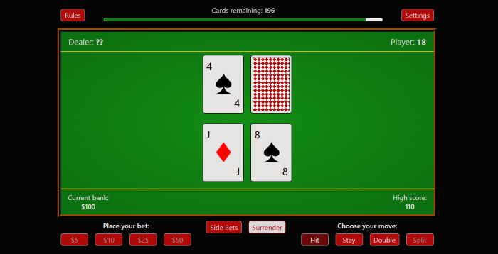

# TypeScript-Blackjack

[View source](https://github.com/KSmith8888/TypeScript-Blackjack)

| Overall rating | Screenshot score |
| :---: | :---: |
| **28/100** | **35/100** |

Read the scoring rationale

### Overall rating

Closest catalog comparator is Turbo Kart Rally (40/100, complete single-track 3D racer with AI field, items, menus, procedural audio) and second is Kart Royale (50/100, ~60k-line 3D physics/AI/synthesis demo); Neural Sight (30/100, photographic tech prototype with almost no game loop) is the scope floor. This Blackjack is a genuinely complete and rules-faithful 2D card game — full hit/stay/double/split/surrender/insurance, 1-8 deck shoe, side bets, bankroll, settings persistence, TypeScript/Vite structure — so it beats Neural Sight on finished loop depth, but its flat DOM/CSS presentation, single-table scope, dealer-only opposition, and lack of multiplayer, progression, or systems depth place it well below both kart racers on gameplay depth, visual polish, and technical ambition. Evidence gaps: judged from gh api source plus one still screenshot without playing the live build, so balance, sound quality, mobile feel, and long-session robustness are unverified; source and screenshot do not prove performance or fairness.

### Screenshot score

The single inspected gameplay frame is the game's own output and is clean and readable — green felt, four sharp cards, Dealer ?? vs Player 18 scores, bank/high-score bar, shoe meter, and red bet/action buttons — but it is flat DOM/CSS with solid colors, minimal texture, lighting, or staging. Against the catalog calibration of 70/100 for both kart racers' coherent 3D worlds with HUD, scenery, and dynamic composition and Neural Sight's photographic splat scenes, this is a functional card table, not a polished scene. No motion or feel inferred from the still.

## At a glance

| Detail | Value |
| --- | --- |
| Documented creation models | Not established |

## Screenshots

Inspected gameplay frame of the live table UI: flat green felt with orange border, top bar with Rules and Settings buttons and a Cards remaining: 196 shoe meter, dealer row showing 4 of Spades plus a face-down red-pattern card scored as ??, player row showing Jack of Diamonds plus 8 of Spades scored as Player: 18, bottom bar with Current bank $100 and High score 110, red Place your bet ($5/$10/$25/$50), Side Bets, Surrender, and Choose your move (Hit/Stay/Double/Split) buttons. The game's own DOM output, not concept art.

[Original screenshot](https://raw.githubusercontent.com/KSmith8888/TypeScript-Blackjack/main/public/blackjack-readme-screenshot.png)

## Play

- Open the live build at https://blackjack-browser-game.pages.dev/ on desktop or mobile, or run locally with npm install then npm run dev at http://localhost:5173.
- Place a main bet with the $5/$10/$25/$50 buttons and optionally set a $1/$5/$10 rotating side bet on the initial two-card combination.
- After four cards are dealt, use Hit to take a card, Stay to hold, Double to double the wager for one card, or Split on pairs; Surrender is available early when enabled.
- Beat the dealer without going over 21; dealer must hit 16 or less and stands or hits soft 17 per settings, blackjack pays per rules, ties push.
- Open Settings to change deck count (1-8, default 4), dealer soft-17 behavior, split-ace rules, surrender/insurance/side-bet toggles, draw speed, sound volume, and auto-reset.

## Mechanics

- Full blackjack round loop: bet, four-card deal with hidden hole card, hit/stay/double/split/surrender, dealer reveal and draw, payout or push
- Insurance offered when dealer shows an ace at half the original bet
- Configurable shoe of 1-8 decks with shuffle modal, cards-remaining meter, and shoe-penetration reshuffle
- Dealer stands on soft 17 by default with an adjustable hit-on-soft-17 rule
- Split hands with multi-hand resolution, optional hitting and doubling on split aces
- Late surrender option and blackjack payout rules surfaced in the rules modal
- Rotating set of high-payout two-card side bets (for example two King of Hearts at 150/1) with modal win fanfare
- Bankroll starting at $100 with persistent high score, bet disabling, game-over reset, and next-hand flow
- Adjustable draw speed (Relaxed, Normal, Instant) with card, flip, shuffle, and UI sounds plus mute and volume control
- Persisted settings via localStorage for decks, rules toggles, sound, volume, side-bet amount, and auto-reset

## Tags

- blackjack
- card-game
- casino
- 2d
- browser-game
- typescript
- vite
- single-player
- side-bets

## Reconstructed prompt

Build a classic single-player Blackjack browser game in TypeScript and Vite with a green-felt DOM table: full rules (hit, stay, double, split, late surrender, insurance), 1-8 deck shoe with shuffle meter, soft-17 and split-ace settings, rotating high-payout two-card side bets, $100 bankroll with high score, settings/side-bet/rules modals, card and UI sounds with mute and volume, draw-speed options, localStorage persistence, and mobile plus desktop layout deployed as a static site.

## Source evidence

- Classic TypeScript Blackjack playable in browser on mobile or desktop, with adjustable gameplay/rule settings and a rotating side-bet feature paying up to 150/1 on combinations such as two King of Hearts. ([source](https://github.com/KSmith8888/TypeScript-Blackjack/blob/main/README.md))
- Rule set includes 1-8 decks (default 4), dealer stands on soft 17 by default with a toggle, split-ace hitting/doubling off by default, late surrender and insurance at half bet, and Relaxed/Normal/Instant draw speed. ([source](https://github.com/KSmith8888/TypeScript-Blackjack/blob/main/README.md))
- Code is a small Vite plus TypeScript app with 10 source modules (Game, Player, Dealer, Deck, Hand, Card, Table, SettingsMenu, SideBetsMenu, SideBets) and only Vite, TypeScript, and ESLint as dev dependencies. ([source](https://github.com/KSmith8888/TypeScript-Blackjack/blob/main/package.json))
- Dealing, hole-card reveal, insurance modal, initial-blackjack check, shoe-penetration reshuffle, and timed draw sequencing are implemented in the Game controller. ([source](https://github.com/KSmith8888/TypeScript-Blackjack/blob/main/src/index.ts))
- Player supports betting with bankroll deduction, ace-aware totals with overage correction, hit, stay, double, split, and bust routing across single and multi-hand states. ([source](https://github.com/KSmith8888/TypeScript-Blackjack/blob/main/src/player.ts))
- Dealer draws from a random shoe index, tracks ace overage, renders only face-up cards until reveal, and hits below 17 or on soft 17 when that setting is on. ([source](https://github.com/KSmith8888/TypeScript-Blackjack/blob/main/src/dealer.ts))
- Side-bet engine holds a rotating list of exact two-card combination bets with payouts around 125-150 to 1 and a win modal with dedicated sound. ([source](https://github.com/KSmith8888/TypeScript-Blackjack/blob/main/src/side-bets.ts))
- Settings menu persists mute, volume, deck count, soft-17, split-ace, draw speed, side-bet, surrender, insurance, and auto-reset choices in localStorage. ([source](https://github.com/KSmith8888/TypeScript-Blackjack/blob/main/src/settings-menu.ts))
- Live deployment is a Cloudflare Pages static build, and the repo is MIT-licensed with 7 stars, TypeScript as primary language, and card/sound assets attributed to Pixabay and Freesound authors. ([source](https://github.com/KSmith8888/TypeScript-Blackjack/blob/main/README.md))

## Fictional reviews

Treat these as illustrative, not real user reviews.

- 70/100: Fictional illustrative review: clean little casino loop — I turned on 8 decks, soft-17 hit, and late surrender, and the shoe meter plus instant deal speed made grinding hands snappy. Side bets are pure lottery but fun.
- 50/100: Fictional illustrative review: does everything real blackjack needs — split, double, insurance all worked — but the flat green table and silent-looking still frame feel more spreadsheet than Vegas. Fine on mobile, forgettable visually.
- 100/100: Fictional illustrative review: as a fictional rules nerd I love this: configurable decks, split-ace rules, bankroll with high score, and a 150-to-1 King-of-Hearts side bet. Not flashy, just correct, and it never broke.

## Links

- [Source repository](https://github.com/KSmith8888/TypeScript-Blackjack)
- [Related link](https://blackjack-browser-game.pages.dev/)
- [Related link](https://github.com/KSmith8888/TypeScript-Blackjack/blob/main/README.md)
