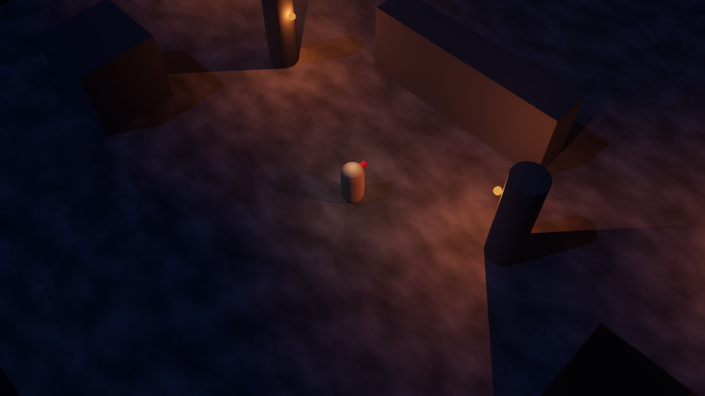

# Path of Werdna

[View source](https://github.com/Werdna1976/PathOfWerdna)

| Overall rating | Screenshot score |
| :---: | :---: |
| **42/100** | **30/100** |

Read the scoring rationale

### Overall rating

Far from AAA: placeholder capsule/box art, no audio evidence, one goblin enemy type, three zones (test arena plus camp plus shore), and no verified playable web build (Godot import only), with XP/levels/skill-tree/content deferred. Systems documentation is unusually deep for a prototype (50 bases, 40 affixes, 8 orbs, gem supports, defenses, vendors, 8 headless test suites). Most relevant comparators: neverquest (45, deeper progression and playable web but text-only) and THORNMERE (46, narrower retro RPG with stronger visual/UI polish) sit above; Wilderness (44, ambitious unplayable 3D survival) sits just above on proven breadth; level with SpaceHo2/Zoo Keeper (42) and above Turbo Kart Rally/Ballz (40, complete but shallow arcade loops) and 2048/scumm-game (38) on ARPG systems ambition despite weaker visual/playability proof. Evidence gaps: no live playthrough; playability, performance, balance, and late-game depth unverified from docs and one still.

### Screenshot score

Single inspected gameplay frame shows coherent dark fog/torch lighting with shadows and readable hero marker, but only primitive placeholder boxes, pillars, and floor with no HUD, enemies, items, or composed scene. At the catalog floor with neverquest (30, tidy but flat text UI) and T-Rex Runner (30, near-blank runner frame), well below THORNMERE (60, textured portrait/dungeon/town UI), OSRS Tower Defense (65, dense boss-wave board), and Kart Royale/Turbo Kart/Neural Sight (70s, detailed 3D worlds). Judged from still only; no motion or feel inferred.

## At a glance

| Detail | Value |
| --- | --- |
| Repository created | 26 Sep 2026 · 16:29 UTC |
| Added to catalog | 27 Sep 2026 · 06:13 UTC |
| Last updated | 27 Sep 2026 · 06:13 UTC |
| Documented creation models | Not established |

## Screenshots

Inspected 1600x900 runtime frame: dark isometric stone floor with mottled texture, capsule hero with red facing marker centered, two torch pillars casting warm orange pools and long shadows, primitive box/crate and wall blocks; no HUD, enemies, items, or UI visible; the game's own output per capture\_screenshot flow, explicitly placeholder meshes.

[Original screenshot](https://raw.githubusercontent.com/Werdna1976/PathOfWerdna/main/tests/screenshot_m1.png)

## Play

- Import project.godot into Godot 4.7.2 and press F5; there is no verified browser playable build.
- Hold left click to move to the cursor, click ground labels to pick up loot, click vendors to trade.
- Hold right click to attack with the RMB skill; use Q W E R T for socketed skills and 1/2 for health/mana potions.
- Press I for PoE-style inventory and equipment, C for character sheet, Alt in tooltips for affix tiers.
- Right-click an orb then left-click an item to craft (Shift keeps the orb); travel via zone doorways between camp and shore.

## Mechanics

- Click-to-move isometric navigation with fixed 55-degree pitch camera
- Melee active skills Heavy Strike, Cleave, and Leap Slam with mana and cooldowns
- Socketed active plus support gems (Added Fire, Melee Splash, Faster Attacks, Life Leech, Brutality) with Default Attack fallback
- PoE-style loot with 50 bases, 40 tiered affixes, rarity weights, item levels, sockets, and rare names
- Eight crafting orbs including Transmutation, Augmentation, Alteration, Regal, Chaos, Ascension, Scouring, and Jeweller's
- 10-slot equipment, attributes, block/evasion/armour/resists/energy-shield, potions with kill charges
- Vendor town with gear and gem shops, shard economy, and zone travel between safe camp and goblin shore

## Tags

- action-rpg
- isometric
- dungeon-crawler
- loot
- crafting
- single-player
- godot
- 3d
- prototype

## Controls

- Mobile controls: Not established
- Motion controls: Not established
- Gamepad: Not established
- Keyboard/mouse: Supported

## Player modes

- Human players: 1
- Modes: single-player

## Technologies

- **Godot 4.7.2** — engine ([evidence](https://github.com/Werdna1976/PathOfWerdna))
- **GDScript** — language ([evidence](https://github.com/Werdna1976/PathOfWerdna/tree/main/tests))
- **Jolt Physics** — physics ([evidence](https://raw.githubusercontent.com/Werdna1976/PathOfWerdna/main/project.godot))
- **Forward Plus** — rendering ([evidence](https://raw.githubusercontent.com/Werdna1976/PathOfWerdna/main/project.godot))

## Reconstructed prompt

Build a dark isometric Path-of-Exile-like action RPG in Godot 4.7 with click-to-move, right-click melee skills, QWERT skill bar, potions, PoE-style grid inventory and 10-slot equipment, socketed active/support gems, JSON item bases and affixes with rarity tiers, 8 crafting orbs, goblin enemies, a safe vendor town and combat shore zone, torch/fog lighting, and headless milestone tests.

## Source evidence

- Repository is a public Godot 4.7.2 isometric action RPG in the spirit of Path of Exile; README documents milestones Walk, Fight, Gems/potions, Items/drops, Inventory/equipment, Sockets/gems, Crafting, and Town/vendors/zones with test arena, Werdna's Camp town and Goblin Shore zone. ([source](https://github.com/Werdna1976/PathOfWerdna))
- Design doc confirms Godot 4.7.2 3D placeholder-shapes approach, dark torch/fog tone, 10 gear slots, item-level/affix-tier loot model, 3 active and 5 support gems, charms, vendors, and deferred XP/levels/skill-tree/content milestones. ([source](https://raw.githubusercontent.com/Werdna1976/PathOfWerdna/main/DESIGN.md))
- project.godot sets main scene to scenes/main.tscn, features Godot 4.7 with Forward Plus, Jolt Physics, physics interpolation, 1920x1080 viewport, perspective-friendly nav/physics layers (world/player/enemy/player\_attack/enemy\_attack/npc), and mouse/keyboard input actions (move, attack, skill\_1-5, potion\_1-5, inventory, character, passives, show\_labels, menu). ([source](https://raw.githubusercontent.com/Werdna1976/PathOfWerdna/main/project.godot))
- Controls table documents working left-click move, right-click Heavy Strike skill, QWERT skill slots, 1/2 potions, I inventory, C character sheet, orb crafting, Alt affix tiers, ground-label pickup, Esc panels; P passive tree bound with no behavior yet. ([source](https://github.com/Werdna1976/PathOfWerdna))
- Combat/loot scope: Heavy Strike/Cleave/Leap Slam plus 5 supports, goblins with 40 life and 4-7 damage, 50 item bases, 40 affixes, rarity weights, 8 orb types, PoE-style 12x5 inventory, 10-slot equipment, block/evasion/armour/resist/energy-shield defenses, and two vendors (Greta gear, Ilsa gems) with shard economy. ([source](https://github.com/Werdna1976/PathOfWerdna))
- Run instructions require importing project.godot into Godot 4.7.2 and pressing F5; no web export, release, homepage, or playable browser URL is documented, and About lists no description, website, or topics. ([source](https://github.com/Werdna1976/PathOfWerdna))
- assets/ contains only .gitkeep (placeholders per docs); tests/ lists headless GDScript suites (walk, fight, skills, loot, equipment, gems, crafting, town) plus capture\_screenshot.gd and screenshot\_m1.png, confirming GDScript source and a single checked-in gameplay capture. ([source](https://github.com/Werdna1976/PathOfWerdna/tree/main/tests))
- No catalog directory matches this repository; local games/ listing has no Werdna or Path-named entry, so this is a new catalog candidate. ([source](https://github.com/Werdna1976/PathOfWerdna))

## Fictional reviews

Treat these as illustrative, not real user reviews.

- 78/100: The item bible alone hooked me: tiered affixes, tags, orb upgrades that keep your mods. I theory-crafted a mace stunner for an hour from text files.
- 55/100: Cleave feels fine and vendors work, but it is still capsule-man versus goblin in a dark box. I want a real dungeon before I commit.
- 95/100: Leap Slam across the shore, splash-cleave the pack, vendor the rares for orbs, repeat. The loop already whispers Path of Exile.

## Links

- [Source repository](https://github.com/Werdna1976/PathOfWerdna)
