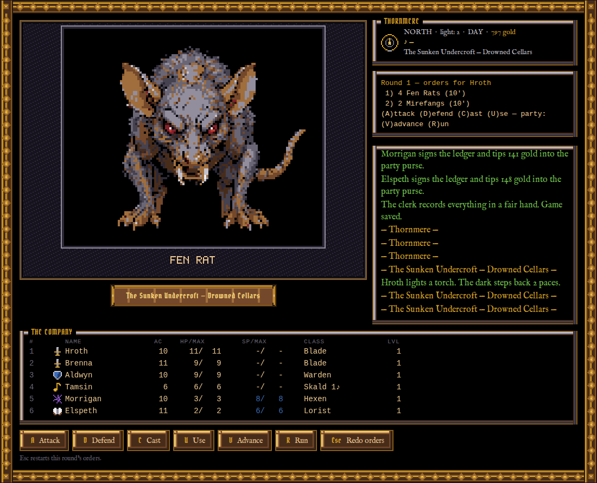
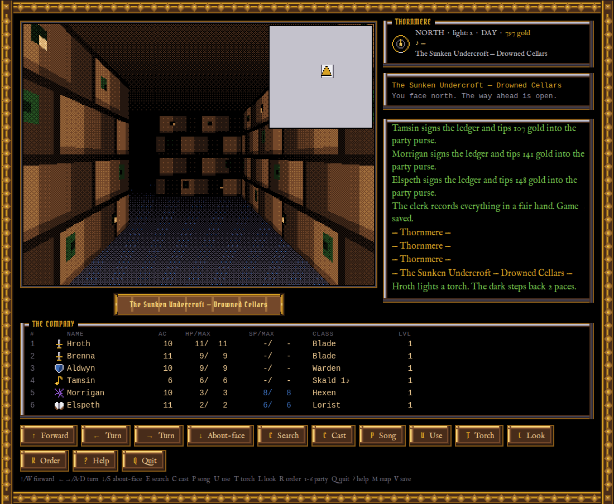
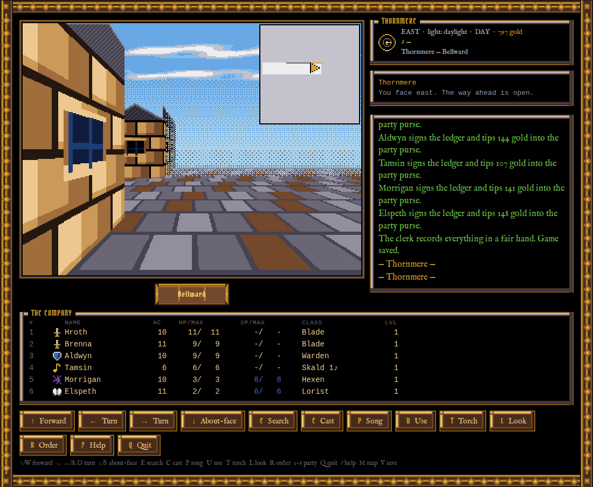
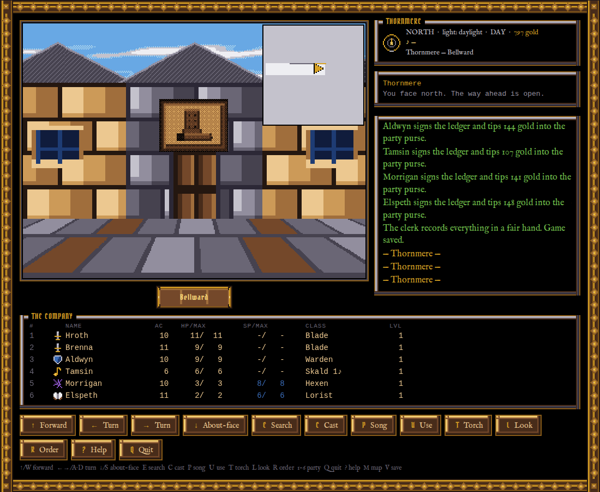
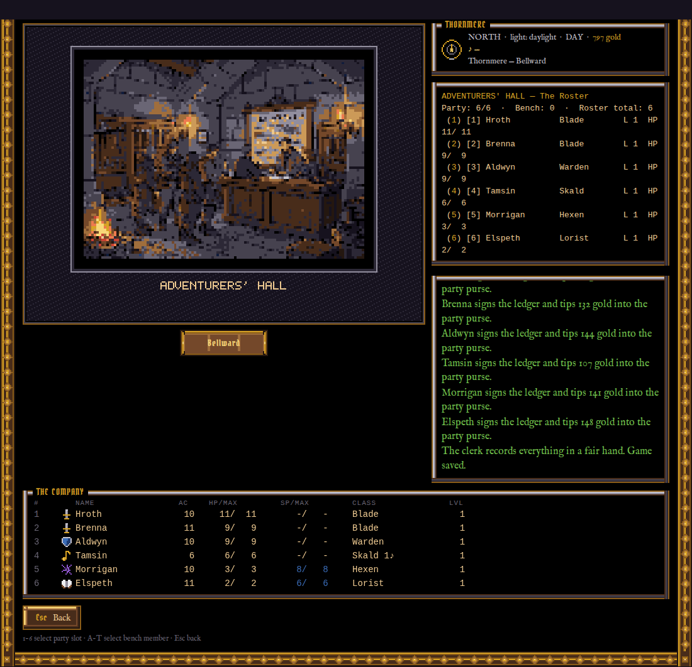
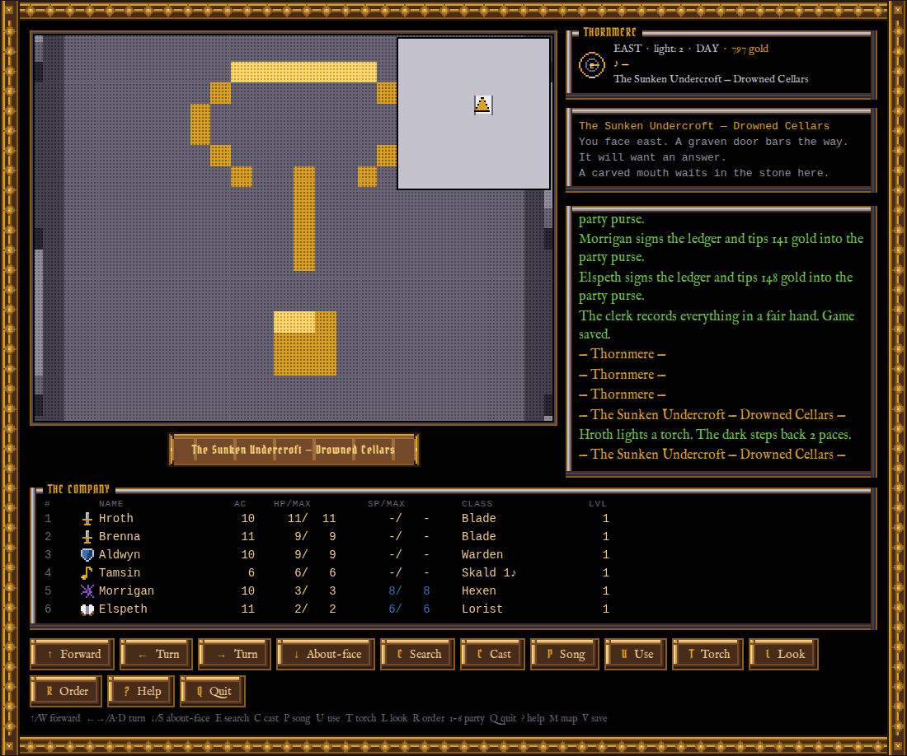
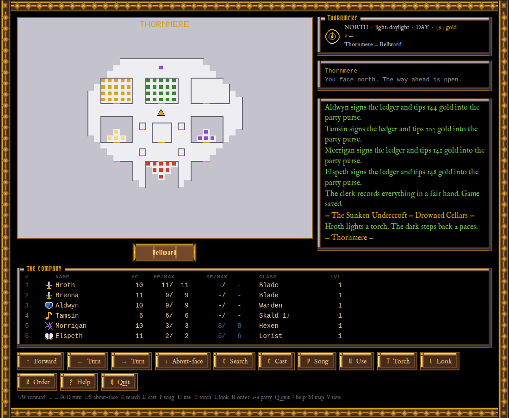
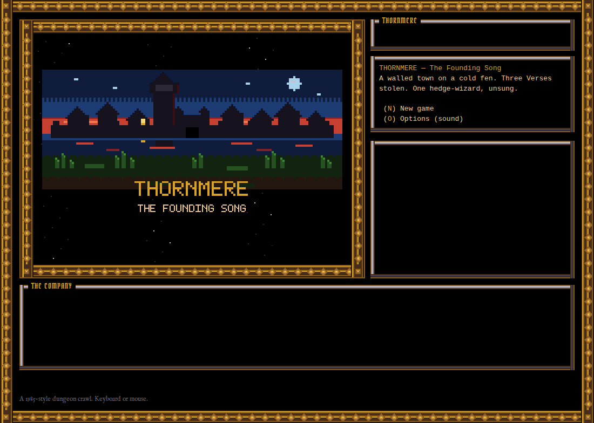

# THORNMERE — The Founding Song

[View source](https://github.com/dgahagan/THORNMERE)

| Overall rating | Screenshot score |
| :---: | :---: |
| **46/100** | **60/100** |

Read the scoring rationale

### Overall rating

Far from AAA (no voice, cinematics, multiplayer, live-ops scale; 320x240 retro bitmaps and synth audio by design), but the strongest retro-RPG package in the catalog. Most relevant comparators: neverquest (45 overall, deepest systems scope with 8 attributes/100+ quests but monochrome text UI only) and Kart Royale (50 overall, ~60k-line 3D kart tech demo on one 1.6km track). THORNMERE matches neverquest on systems breadth (57 monsters, 84 spells, 7 songs, 61 items, 5 races, 10 classes, town plus 3 dungeons, class-change to Riddlemaster, 53 logic/art/audio/feelies tests) while exceeding it clearly on visual polish and technical execution (textured first-person viewport with distance shading, animated monster portraits, signboard navigation, parchment automap, zero-dependency Canvas engine with DOM-free core under node --test). It trails Kart Royale on real-time 3D physics/AI ambition and moment-to-moment action feel, and Turbo Kart Rally (40 overall, complete 3D kart loop with 8 racers/items/AI/menus) on pick-up-and-play arcade depth, but beats Turbo Kart on campaign scope and content editability. Above Taipo (35, complete typing-TD niche loop on one tilemap), Neural Sight (30, 24-hour photographic prototype with almost no game loop), TypeScript-Blackjack (28, rules-faithful single-table card game), Beachy Beachy Ball (25, single ball-roller mechanic), and curiositY (18, 15 static riddle pages) on gameplay depth, scope, and finished-loop completeness. Evidence gaps: judged from repository content via GitHub API plus raw files and 9 inspected stills only; no live playthrough, so playability, balance, pacing, and performance are unverified and not proven by code or screenshots.

### Screenshot score

Visible gameplay frames show a coherent deliberate 1985 style: chunky 320x240 indexed pixels, textured walls with torch/daylight distance shading, readable signboard streets, a large detailed Fen Rat portrait, roster/roster-chip UI, and ornate thorn-vine chrome with blackletter/serif type. Composition is consistent and charming but flat and low-detail next to the catalog 70s (Kart Royale, Turbo Kart Rally, Neural Sight), which show dense 3D/photographic scenes with lighting, crowds, scenery, and dynamic framing. Above Taipo (55, sparser flat pixel TD board) on texture depth, portrait quality, and UI polish, and well above TypeScript-Blackjack (35), Beachy Beachy Ball (35), and neverquest (30) flat DOM/text presentations. Title card and full-screen automap discounted as non-gameplay/menu. Judged from stills only; no motion or game feel inferred.

## At a glance

| Detail | Value |
| --- | --- |
| Documented creation models | Not established |

## Screenshots

Inspected gameplay combat frame: large Fen Rat pixel portrait (grey-brown fur, red eyes, fangs) in the animated portrait window labeled FEN RAT, orders panel Round 1 for Hroth vs 4 Fen Rats and 2 Mirefangs, Attack/Defend/Cast/Use/Advance/Run buttons, six-person roster (Blade/Blade/Warden/Skald/Hexen/Lorist) with AC/HP/SP, event log with torch text. Game's own runtime output, sharpest portrait detail.

[Original screenshot](https://raw.githubusercontent.com/dgahagan/THORNMERE/main/docs/screenshots/combat.png)

Inspected torchlit dungeon gameplay: textured brown-block corridor receding into darkness with palette ramp shading, corner automap overlay inset top-right, status line The Sunken Undercroft - Drowned Cellars, roster and Forward/Turn/About-face/Search/Cast/Song/Use/Torch/Look buttons. Game's own output showing light-radius mechanic.

[Original screenshot](https://raw.githubusercontent.com/dgahagan/THORNMERE/main/docs/screenshots/dungeon-corridor.png)

Inspected daylit town street gameplay: half-timbered facades left, cobbled street with brown/grey tiles hazing toward a dithered blue sky horizon, corner map inset, Bellward plaque, same roster and command bar. Game's own output showing daylight view distance.

[Original screenshot](https://raw.githubusercontent.com/dgahagan/THORNMERE/main/docs/screenshots/town-street.png)

Inspected street gameplay facing a stone building with a boot signboard over the door (Greta's Provisioner), symmetrical facade with blue windows, cobbled foreground, Bellward plaque, roster and command bar. Game's own output showing navigation-by-signboard.

[Original screenshot](https://raw.githubusercontent.com/dgahagan/THORNMERE/main/docs/screenshots/signboard.png)

Inspected Adventurers' Hall interior frame: dim torchlit tavern-hall pixel scene with fireplace, counter, and figures in the viewport, roster panel listing the six-party muster, event log with ledger/gold entries. Game's own output; interior vignette rather than maze traversal.

[Original screenshot](https://raw.githubusercontent.com/dgahagan/THORNMERE/main/docs/screenshots/adventurers-hall.png)

Inspected close-up riddle-door frame: flat grey stone face filling the viewport with a gold pixel mouth/eye motif, log reading a graven door bars the way and a carved mouth waits in the stone. Game's own output but a single flat special frame, less scene detail than maze/street views.

[Original screenshot](https://raw.githubusercontent.com/dgahagan/THORNMERE/main/docs/screenshots/riddle-door.png)

Inspected full-screen parchment automap of Thornmere: white street grid with colored room blocks (yellow, green, red, purple) and gold position marker on grey, THORNMERE header. Utility overlay over the live game, not a 3D/pixel scene; discounted for graphics scoring.

[Original screenshot](https://raw.githubusercontent.com/dgahagan/THORNMERE/main/docs/screenshots/automap.png)

Inspected title card: night silhouette of a walled town on a fen (tower, houses, red sunset band, green reeds, moon) with THORNMERE - THE FOUNDRING SONG wordmark, New game/Options/Continue menu at right, thorn-vine chrome frame. Menu/title, not active gameplay; discounted.

[Original screenshot](https://raw.githubusercontent.com/dgahagan/THORNMERE/main/docs/screenshots/title.png)

## Play

- Play the hosted build at https://dgahagan.github.io/THORNMERE/ (no install), or run locally with npm start (python3 http.server 8377) and open http://127.0.0.1:8377/.
- Start a New game and choose Remastered (automap, save-anywhere, shared inventory), Legacy (1985 rules, graph paper), or Custom toggles.
- Walk into the Adventurers' Hall and create six characters (proven party: Blade, Blade, Warden, Skald, Hexen, Lorist); reroll until front-liners have ST/CN 15+.
- Shop at Greta's Provisioner for weapons, armor, a reed pipe for the Skald, and torches; claim shared-pool items with Pn in the character sheet.
- Explore Thornmere by signboard, gather rumors at The Drowned Goose, farm XP in shuttered houses, then descend via the Boarded Tannery into the Sunken Undercroft.
- Step with Up/W, turn with Left/Right (A/D), about-face with Down/S, search with E, torch with T, song with P, cast with C, use items with U, map with M (Remastered).
- In combat issue per-character orders each round: Attack, Defend, Cast, Sing, Hide, Use, Advance 10 ft, or Run; resolve in DX initiative until one side falls.
- Heal at the Temple, recharge SP at Roskva's Spark House, level and buy spell tiers at the Review Board, save at the Hall or with V (Remastered save-anywhere).
- Answer riddle doors by typing the answer, survive spinners, teleporters, darkness and anti-magic zones, and recover the Three Verses from the Undercroft, Barrow, and Needle.
- Class-change casters toward Riddlemaster (Hexen/Lorist to tier 5, Stormcaller, tier 6 in two schools) to open the Needle top floor, then perform the Founding Song at the bell tower to win.

## Mechanics

- Six-character party creation with ST/IQ/DX/CN/LK races, AC counting down from 10, and class prime stats
- First-person grid-maze exploration with textured viewport, palette distance-shading, torch/light radius, and smooth-step glide
- Turn-based party combat vs up to 4 monster groups at 10-90 ft with melee/missile range bands, group advances, and DX initiative
- 84 spells across three schools (Hexen, Lorist, Stormcaller) in 7 tiers, bought whole at the Review Board
- 7 Skald songs each with a persistent exploration effect and a one-round combat flourish, limited by songs-per-day and wine
- Data-driven maze cells: secret doors, spinners, teleporters, darkness and anti-magic zones, trap squares, magic mouths, riddle doors
- Town of Thornmere plus three dungeons (Sunken Undercroft, Howling Barrow, Maldrec's Needle) with bosses and gated verses
- Remastered comforts: parchment automap, save-anywhere slots plus autosave, shared 40-slot inventory, 0.60x XP curve, item charges, 7th summon slot
- Legacy mode with bit-for-bit classic rules plus Custom per-feature toggles and class-change chain to Riddlemaster
- Synthesized WebAudio chiptune (town/day-night, per-dungeon drones, combat, fanfare, title) with ducking and persisted volumes
- Original text-grid pixel art on a 32-color palette with palette-swap variants, animated portraits, and ornate 9-slice thorn-vine chrome
- Printable feelies generated from game data: cloth map, ~25-page manual, and command card PDFs

## Tags

- dungeon-crawler
- rpg
- retro
- pixel-art
- bard's-tale-like
- turn-based
- party-based
- first-person
- browser-game
- vanilla-js
- chiptune
- ai-assisted

## Reconstructed prompt

Build THORNMERE: The Founding Song, a Bard's Tale (1985)-style first-person dungeon crawler in vanilla JS with zero dependencies and no build step: 320x240 indexed-color Canvas viewport with palette distance-shading, animated monster portraits, and ornate thorn-vine chrome; a town plus three dungeons of data-driven maze cells (secret doors, spinners, teleporters, darkness, anti-magic, riddle doors); six-character parties with 5 races and 10 classes, 57 monsters, 84 spells in 3 schools, 7 bard songs, 60+ items; Remastered vs Legacy vs Custom modes (automap, save-anywhere, shared inventory, reduced XP, charges, summon slot); all art as text-grid palettes and all music/SFX as synthesized note patterns; 53 automated tests, printable feelies PDFs, and a playable static browser build.

## Source evidence

- Repo is dgahagan/THORNMERE: Bard's Tale (1985)-style dungeon crawler in vanilla JS, zero deps, no build, all pixel art and chiptune as text data, built with Claude Fable 5; 1 star, 0 forks, JavaScript primary, homepage is the playable Pages build. ([source](https://github.com/dgahagan/THORNMERE))
- Playable in browser with no install or accounts; saves in localStorage; all audio synthesized in code and all art (including UI chrome) is text-grid pixel data except four OFL fonts. ([source](https://github.com/dgahagan/THORNMERE/blob/main/README.md))
- Content scope stated as town of Thornmere plus three dungeons, 50+ monsters, 84 spells, 7 songs, 60+ items, every sprite and melody original and in editable text data files. ([source](https://github.com/dgahagan/THORNMERE/blob/main/README.md))
- Verified data counts via raw files: 57 monsters, 84 spells, 7 songs, 61 items, 5 races, 10 classes. ([source](https://github.com/dgahagan/THORNMERE/blob/main/data/monsters.json))
- Renders to a 320x240 indexed-color framebuffer (Uint8Array palette indices) scaled 2x nearest-neighbor; game core is pure logic runnable under node --test; any static file server runs it. ([source](https://github.com/dgahagan/THORNMERE/blob/main/README.md))
- Portrait art generated by local FLUX.2-klein on a desk-side GPU, quantized to the 32-color palette as text grids, adjudicated sprite-by-sprite with seeds, prompts, and verdicts on record; manifest is source of truth. ([source](https://github.com/dgahagan/THORNMERE/blob/main/docs/art-pipeline.md))
- Remastered vs Legacy vs Custom modes with seven comforts: automap, save-anywhere, shared inventory, reduced XP x0.60, item charges, 7th summon slot; plus always-on help, spell browse, item inspect, rumor journal. ([source](https://github.com/dgahagan/THORNMERE/blob/main/README.md))
- npm test covers four suites totaling 53 tests: logic/combat/leveling/save-migration, art grid/legend/portrait coverage, audio pattern/song integrity, and feelies PDF generation checks. ([source](https://github.com/dgahagan/THORNMERE/blob/main/README.md))
- 98 commits over June-July 2026 per README; repo tree is 248 files with 52 JS files and 35 JSON data files; package.json has only a pdfkit devDependency for feelies. ([source](https://github.com/dgahagan/THORNMERE/commits/main))
- Printable feelies (cloth map, ~25-page manual, command card PDFs) generated deterministically from game data; live build responds HTTP 200 at the Pages homepage. ([source](https://dgahagan.github.io/THORNMERE/))

## Fictional reviews

Treat these as illustrative, not real user reviews.

- 85/100: \[Fictional review\] Imagined crawler fan: ordering all six against the Fen Rat while the portrait glared back felt exactly like 1985, and lighting a torch as the corridor palette sank darker sold the delve. The riddle door stopped me cold in the best way.
- 60/100: \[Fictional review\] Made-up casual player note: love the thorn-vine chrome and signboard streets, but grid-stepping a full six-person party with spell-point triage is slow going next to the kart racers' instant speed. Great for retro loyalists, heavy for everyone else.
- 100/100: \[Fictional review\] Invented dev-fan take: zero dependencies, every sprite a text grid, every tune a note pattern, 53 tests plus printable feelies and a seeded local-FLUX art manifest on record? As provenance-obsessed retro craft this is a joy, even if it is not AAA.

## Links

- [Source repository](https://github.com/dgahagan/THORNMERE)
- [Related link](https://dgahagan.github.io/THORNMERE/)
- [Related link](https://github.com/dgahagan/THORNMERE/blob/main/README.md)
- [Related link](https://github.com/dgahagan/THORNMERE/blob/main/docs/art-pipeline.md)
