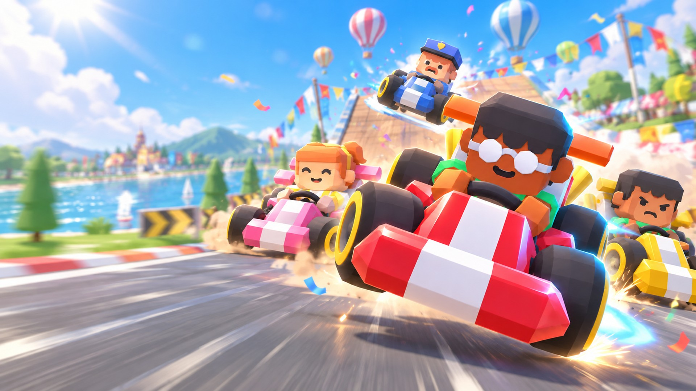
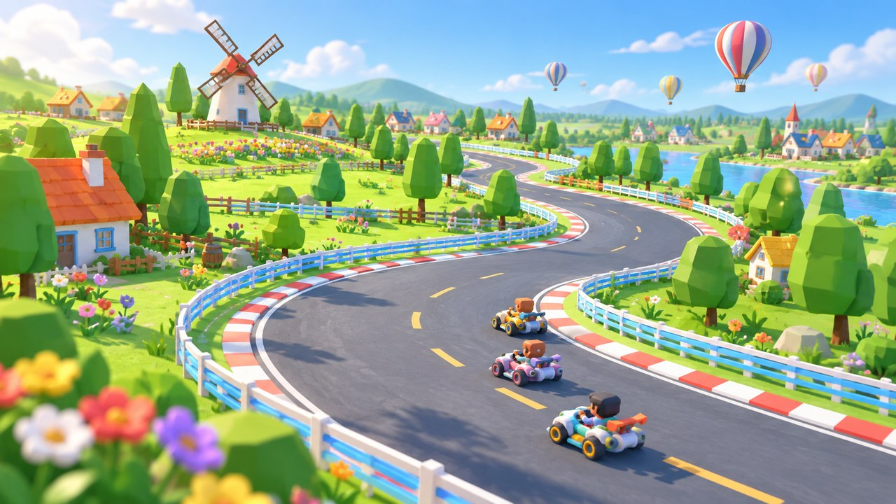

# Gale Kart

[View source](https://github.com/fants/Gale-kart)

| Overall rating | Screenshot score |
| :---: | :---: |
| **54/100** | **Not scored** |

Read the scoring rationale

### Overall rating

Excluding the target, closest comparators are Kart Royale (50 overall / 70 screenshots: complete single-track 3D kart loop with verified HUD gameplay frames), Turbo Kart Rally (40 / 70: single-circuit procedural kart racer with verified gameplay) and Wouf Kart (38 / null: single-track kart prototype with zero screenshots). Gale Kart exceeds all three on documented scope: 8 tracks, 4 modes, 2 four-race Grand Prix cups, ghost time trial, TV-style replays with auto director, 5 karts x 12 drivers, 10 items, weather, 8 themed worlds and shipped macOS/Windows builds with bilingual UI and gamepad support, versus one track each. It therefore ranks above Kart Royale. It trails Ashlands (55, broader open-world RPG systems breadth) and moorestech (64 / 76, verified runtime screenshots, co-op server, modding, years of scale) because no verified runtime gameplay screenshot exists, no browser-playable URL was established, and the game was not played. Evidence gaps: judged from repository/README/releases pages plus raw project.godot/export\_presets.cfg via web fetch (gh api rate-limited); source not executed, so playability, performance, balance and actual rendered quality are not proven.

### Screenshot score

No inspectable gameplay screenshot.

## At a glance

| Detail | Value |
| --- | --- |
| Repository created | 27 Sep 2026 · 00:31 UTC |
| Added to catalog | 27 Sep 2026 · 06:11 UTC |
| Last updated | 27 Sep 2026 · 06:11 UTC |
| Documented creation models | [Claude Opus 5.5](https://github.com/fants/Gale-kart), [gpt-image-2.5](https://github.com/fants/Gale-kart) |

## Screenshots

Inspected 1920x1080 downloaded copy: low-poly karts mid-jump/race on lakeside tarmac with balloons, bunting, drift dust and boost glow. No HUD, minimap, lap or speed readouts. Repository README explicitly attributes home-screen/hero art to GPT Image (gpt-image-2.5), so this is curated AI-generated promotional art, not a verified runtime gameplay capture.

[Original screenshot](https://raw.githubusercontent.com/fants/Gale-kart/main/assets/ui/hero/jump.jpg)

Inspected 1280x720 downloaded copy: aerial view of winding village circuit with windmill, cottages, fences, flowers and three karts. No HUD or race UI. Listed under assets/ui/tracks as a track illustration, a category the README says was generated by GPT Image, so not proven engine output.

[Original screenshot](https://raw.githubusercontent.com/fants/Gale-kart/main/assets/ui/tracks/village.jpg)

Inspected 1280x720 downloaded copy: night neon figure-8 overpass with three karts, glowing towers and moon. No HUD. Same track-illustration set documented as AI-generated images, not a verified gameplay frame.

[Original screenshot](https://raw.githubusercontent.com/fants/Gale-kart/main/assets/ui/tracks/city.jpg)

## Play

- Download the macOS Universal or Windows x64 build from the Releases page, or install Godot 4.7 and run \`godot --path .\` (macOS: double-click start-macos.command or press F5 in the editor).
- On first launch wait through the one-time shader compile (Preparing 3D graphics screen, up to 1-2 minutes); later launches are fast.
- Pick Speed Race, Item Race, Time Trial (ghost + live gap) or Grand Prix (Rising Star Cup / Gale Cup, 4 races each, points-based).
- Choose among 5 karts, 12 drivers and 5 paint jobs, set 7 AI rivals on Easy/Normal/Hard over 1, 3 or 5 laps.
- Accelerate/brake with Up/Down or W/S, steer with Left/Right or A/D; drift with Shift or J, fire nitro/item with Space or K, swap items with Q/E, respawn with R, pause with Esc or P.
- Use instant boost (drift over 0.35s then release), start boost (first throttle within 0.35s before or 0.3s after GO), and drafting (3-14 m behind for ~1s) per the in-game tips.

## Mechanics

- KartRider-inspired drift loop with boost gauge, nitro, instant boost, start boost and drafting
- 4 modes: Speed Race, 10-item Item Race, Time Trial with saved ghost and live gap, points-based Grand Prix with 2 cups
- 8 themed tracks with difficulty stars, jumps, shortcuts, cliff road with lower-path recovery and icy low-grip variant
- 5 karts with Speed/Accel/Turn/Drift/Nitro/Weight stats, 12 drivers, 5 paint jobs, 7 AI rivals on 3 difficulties over 1/3/5 laps
- 10 position-weighted items: Nitro, Missile, Water Bomb, Banana, Angel Shield, Storm Cloud, Magnet, Thunder, UFO, Water Fly
- Full flow: title, menu, 3D garage race setup, loading, flyover, countdown, race, finish, 3D podium, TV/chase/orbit/top-down replay with auto director
- Effects: drift smoke and skid marks, white-to-blue drift sparks, nitro flames, draft wind lines, shockwaves, status effects, speed lines and radial blur
- Weather and scenery: windmill village, town, desert pyramids, snowy pines, mushroom forest, gorge waterfalls, circuit, neon city with leaves/sand/snow/fireflies
- Settings for volume, graphics, fullscreen, V-Sync, camera, auto instant boost, FPS display and Chinese/English language
- Render-independent fixed 120 Hz simulation with headless AI races, handling tools and keyboard-bot verification

## Tags

- kart-racer
- racing
- 3d
- godot
- kartRider-like
- single-player
- ai-racers
- grand-prix
- time-trial
- stylized

## Controls

- Mobile controls: Not established
- Motion controls: Not established
- Gamepad: Supported
- Keyboard/mouse: Supported

## Player modes

- Human players: 1
- Modes: single-player

## Technologies

- **Godot 4.7** — engine ([evidence](https://raw.githubusercontent.com/fants/Gale-kart/main/project.godot))
- **GDScript** — language ([evidence](https://raw.githubusercontent.com/fants/Gale-kart/main/project.godot))
- **Forward Plus** — rendering ([evidence](https://raw.githubusercontent.com/fants/Gale-kart/main/project.godot))

## Reconstructed prompt

Build Gale Kart, a KartRider-inspired 3D kart racer in Godot 4.7 (GDScript, Forward Plus): 8 themed tracks, 4 modes (Speed, 10-item Item Race, ghost Time Trial, 2-cup Grand Prix), 5 stat karts x 12 drivers x 5 paints, 7 AI rivals on 3 difficulties, drift/nitro/instant/start/draft boosts, jumps and shortcuts, full title-to-podium flow with TV replays, weather and effects, synthesized SFX plus 10 music tracks, bilingual UI, keyboard plus gamepad, fixed-120Hz decoupled sim with headless tests, and macOS/Windows exports.

## Source evidence

- Repository page identifies fants/Gale-kart as a public Godot kart racing game: 'A kart racing game developed using opus 5.5 and powered by Godot', 0 stars / 0 forks, 52 commits on main, folders assets, docs/superpowers, scenes, src, tests, tools plus README, project.godot and export\_presets.cfg. ([source](https://github.com/fants/Gale-kart))
- README defines the game as a KartRider-inspired 3D kart racer in Godot 4.7 with drifting, boost gauge, nitro, instant/start/draft boosts, jumps, item battles and TV-style replays. ([source](https://github.com/fants/Gale-kart))
- Scope documented: 4 modes (Speed, 10-item Item, Time Trial with ghost + live gap, Grand Prix with Rising Star Cup and Gale Cup of 4 races each); 8 tracks with star ratings and descriptions; 5 karts with 6 stats, 12 drivers, 5 paints; 7 AI rivals on Easy/Normal/Hard over 1/3/5 laps. ([source](https://raw.githubusercontent.com/fants/Gale-kart/main/README.md))
- Full game flow documented: title, menu, race setup with live 3D garage preview, loading, opening flyover, countdown, race, finish, 3D podium, replay/rematch/next track, plus pause, records, controls help, item guide and volume/graphics/fullscreen/V-Sync/camera/auto-boost/FPS/language settings. ([source](https://raw.githubusercontent.com/fants/Gale-kart/main/README.md))
- README Controls table lists keyboard bindings (arrows/WASD, Shift/J drift, Space/K item, Q/E swap, R respawn, C camera, Esc/P pause, H hide HUD, M mute, F11 fullscreen) plus replay keys; this is the evidence for keyboard\_mouse=supported. ([source](https://github.com/fants/Gale-kart))
- Same Controls table lists gamepad bindings (RT/LT pedals, stick/D-pad steer, B/RB/LB drift, A item, X swap, Y respawn, Back camera, Start pause), and the v1.0.0 release notes state Chinese/English UI with gamepad support; this is the evidence for gamepad=supported. ([source](https://github.com/fants/Gale-kart/releases))
- No touch joystick, accelerometer/gyroscope, or mobile-specific controls are documented; the README describes only desktop keyboard/gamepad plus Godot desktop exports, so mobile\_controls and motion\_controls remain unknown rather than not\_supported. ([source](https://github.com/fants/Gale-kart))
- Opponents are described as 7 AI rivals with difficulty levels; no local or online multiplayer is documented, so human\_players=1 single-player; AI opponents are not counted as human players. ([source](https://raw.githubusercontent.com/fants/Gale-kart/main/README.md))
- Play options are GitHub Releases downloads (Windows x64 zip with GaleKart.exe, macOS Universal zip) or running from Godot 4.7 source; no browser-playable URL is offered, so play\_game\_url is null. ([source](https://github.com/fants/Gale-kart/releases))
- project.godot sets config/features to 4.7 and Forward Plus, main scene scenes/main.tscn, autoload GDScript files (store.gd, audio\_manager.gd, game.gd), 1920x1080 viewport and gl\_compatibility rendering method; this evidences the Godot 4.7 engine and GDScript usage. ([source](https://raw.githubusercontent.com/fants/Gale-kart/main/project.godot))
- export\_presets.cfg defines runnable macOS Universal and Windows Desktop x86\_64 export presets (GaleKart.zip / GaleKart.exe), evidencing desktop build targets, not a hosted web play link. ([source](https://raw.githubusercontent.com/fants/Gale-kart/main/export_presets.cfg))
- README Important block attributes every line of code, tracks, tuning, UI, synthesized SFX/music, tests and builds to Claude Opus 5.5 in Claude Code, with direction/playtesting by bilibili @铂金小鸟; image assets to Opus 5.5 calling OpenAI GPT Image (gpt-image-2.5), covering logo, icons, trophies, track illustrations, home art, menu backgrounds and billboards. 3D models are Kenney CC0 and fonts ZCOOL KuaiLe/Bungee OFL. ([source](https://raw.githubusercontent.com/fants/Gale-kart/main/README.md))
- Inspected hero/track JPEGs lack HUD, minimap, lap counters or results UI and belong to asset paths the README labels as generated illustrations/home art; they are therefore treated as promotional reference images, not verified runtime gameplay, so screenshot\_based\_score is null. ([source](https://github.com/fants/Gale-kart))
- No verified catalog match: local catalog Games section (35 entries topped by moorestech 64, Ashlands 55, Kart Royale 50, Turbo Kart Rally 40, Wouf Kart 38) contains no fants/Gale-kart entry or identical repository/playable/project reference, so catalog\_slug is null. ([source](https://github.com/fants/Gale-kart))

## Fictional reviews

Treat these as illustrative, not real user reviews.

- 82/100: \[Fictional review\] Imagined KartRider fan: eight tracks with a real Grand Prix, cliff-road shortcut on Forest Hairpin and neon figure-8 finale — the most complete indie kart package in the catalog so far.
- 58/100: \[Fictional review\] Made-up casual player note: menus, ghost time trial and TV replays sound great, but I never saw a real HUD screenshot and there is no browser build, so I cannot judge how it actually drives.
- 100/100: \[Fictional review\] Invented tech-enthusiast take: a fixed-120Hz decoupled sim, headless AI races, keyboard bots and synthesized music, all allegedly from one model session? As an agentic Godot experiment this is wild.

## Links

- [Source repository](https://github.com/fants/Gale-kart)
- [Releases (desktop downloads)](https://github.com/fants/Gale-kart/releases)
