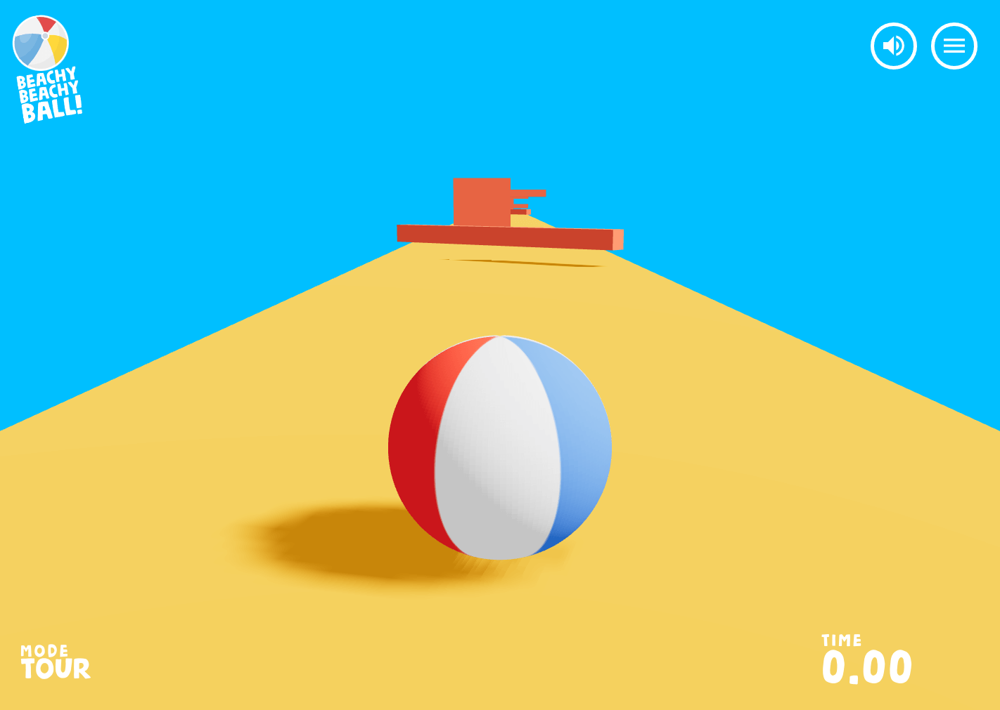
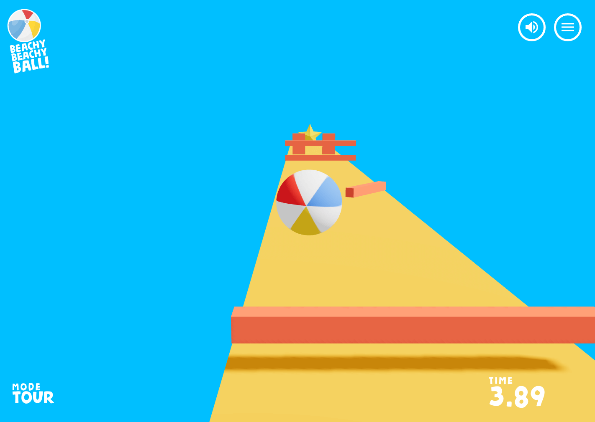
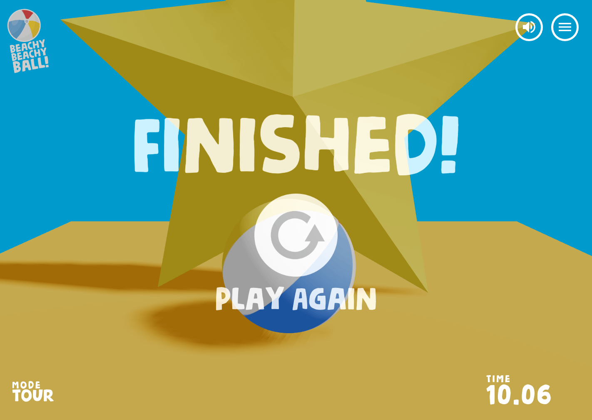
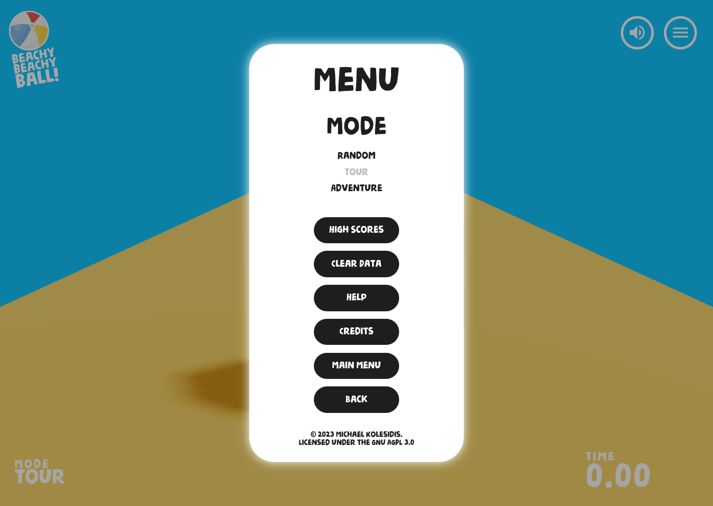
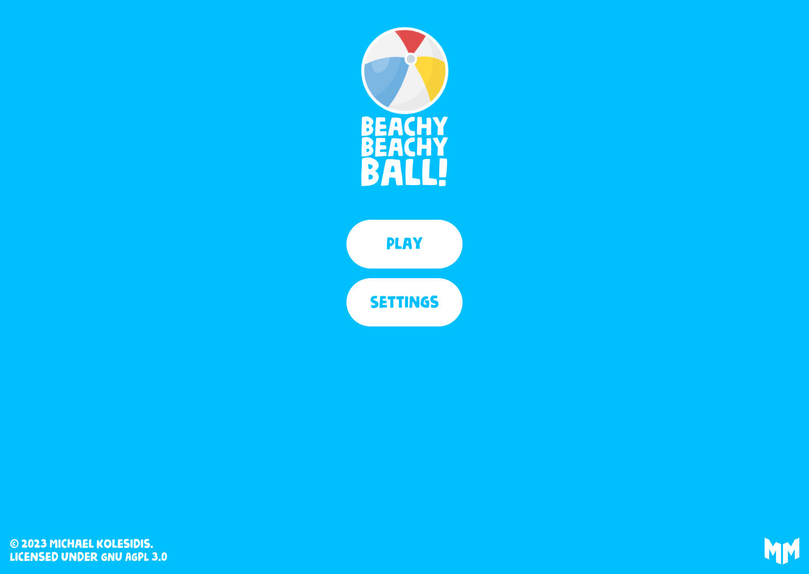
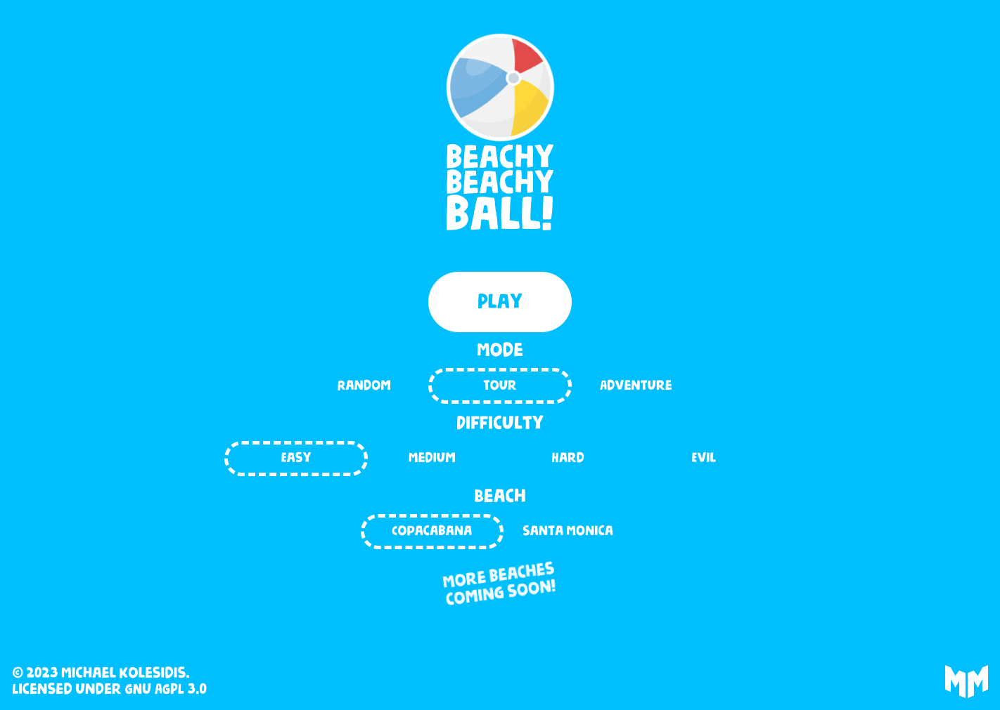

# Beachy Beachy Ball!

[View source](https://github.com/michaelkolesidis/beachy-beachy-ball)

| Overall rating | Screenshot score |
| :---: | :---: |
| **25/100** | **35/100** |

Read the scoring rationale

### Overall rating

Closest catalog comparators are Turbo Kart Rally (40/100) and Kart Royale (50/100) as complete browser Three.js driving games with AI, items, laps, HUD and menus, and Neural Sight (30/100) as a tiny-scope technical prototype with photographic scenes but no full loop. Beachy Beachy Ball sits below all three: single roll-to-star mechanic with no AI, items, laps or multiplayer, two short tour layouts plus random remixes versus full kart-racer systems, and flat minimal art versus the kart games' tracks/crowds/props and Neural Sight's captured realism. It earns credit for a complete loop (menu, settings, timer, high scores, finish state) and competent Rapier kinematic-obstacle execution, but scope, depth, visual polish and technical ambition are narrower. Evidence gaps: judged from README plus gh api source and 6 still screenshots only, did not play live build, no video, no performance/balance/QA data; stills and code alone do not prove playability, frame rate, or difficulty balance.

### Screenshot score

Judged only from stills without inferring motion. Best gameplay frames show a coherent minimal style — glossy-paneled beach ball with soft shadow on a flat orange strip under cyan void sky, red bar obstacles and tiny gold star, clean mode/time HUD. Against catalog baselines (Kart Royale 70, Turbo Kart Rally 70, Neural Sight 70) with detailed tracks, crowds, billboards, lighting variation and photographic texture, this has far less scene detail, no environment beyond track plus sky, flat untextured surfaces, and weak composition (long empty runway, distant tiny obstacles). Rewarded for clean readable stylization and consistent palette; discounted heavily for sparseness. Menus/title/end-screen frames excluded from graphics scoring.

## At a glance

| Detail | Value |
| --- | --- |
| Documented creation models | Not established |

## Screenshots

Inspected gameplay frame: close chase view of red/white/blue beach ball with soft shadow centered on flat yellow-orange track under solid cyan sky, red spinner bar obstacle ahead in distance, minimal HUD with BEACHY BEACHY BALL logo top-left, sound/menu icons top-right, MODE TOUR bottom-left, TIME 0.00 bottom-right. Game's own runtime output, sharpest ball detail of all frames.

[Original screenshot](https://raw.githubusercontent.com/michaelkolesidis/beachy-beachy-ball/main/screenshots/screenshot_003.png)

Inspected gameplay frame: higher chase view of smaller beach ball mid-track approaching coral sliding-bar obstacle, gold star visible at far end of orange runway under cyan sky, long soft shadows, same TOUR HUD with TIME 3.89. Shows more level depth but smaller ball detail. Game's own runtime output.

[Original screenshot](https://raw.githubusercontent.com/michaelkolesidis/beachy-beachy-ball/main/screenshots/screenshot_004.png)

Inspected end-screen frame: giant low-poly gold star fills background with FINISHED! and PLAY AGAIN plus replay icon over beach ball on orange track, TOUR HUD TIME 10.06. Overlay on gameplay scene, not active rolling.

[Original screenshot](https://raw.githubusercontent.com/michaelkolesidis/beachy-beachy-ball/main/screenshots/screenshot_005.png)

Inspected in-game menu modal: white rounded panel with MENU, MODE RANDOM/TOUR/ADVENTURE and HIGH SCORES, CLEAR DATA, HELP, CREDITS, MAIN MENU, BACK buttons over dimmed track and cyan sky, timer 0.00 behind. Menu overlay, not gameplay.

[Original screenshot](https://raw.githubusercontent.com/michaelkolesidis/beachy-beachy-ball/main/screenshots/screenshot_006.png)

Inspected title card: solid cyan background with beach-ball logo, BEACHY BEACHY BALL! wordmark, white PLAY and SETTINGS pill buttons, copyright footer. Main menu, no gameplay.

[Original screenshot](https://raw.githubusercontent.com/michaelkolesidis/beachy-beachy-ball/main/screenshots/screenshot_001.png)

Inspected settings title card: same cyan menu with PLAY button plus MODE (RANDOM/TOUR/ADVENTURE), DIFFICULTY (EASY/MEDIUM/HARD/EVIL), BEACH (COPACABANA/SANTA MONICA) selectors and MORE BEACHES COMING SOON note. Menu, no gameplay.

[Original screenshot](https://raw.githubusercontent.com/michaelkolesidis/beachy-beachy-ball/main/screenshots/screenshot_002.png)

## Play

- Open the play site at https://beachybeachyball.michaelkolesidis.com and press Play or Enter on the main menu.
- Optionally open Settings to pick Random or Tour mode, difficulty (Easy/Medium/Hard/Evil), block count (5/10/15/20) or beach (Copacabana/Santa Monica).
- Roll the beach ball forward along the narrow orange track with Arrow keys or WASD, steering to dodge red spinner, limbo and sliding-wall obstacles.
- Press Space to jump over low bars; time jumps since grounded raycast jump only works near the track.
- Reach the gold star at the end of the level to finish and stop the timer; falling off restarts the ball at the start.
- Press R to restart, M to mute/unmute, Esc for the menu modal, P for performance stats.
- Chase stored best times for Random, Copacabana and Santa Monica runs.

## Mechanics

- Physics beach-ball rolling with impulse plus torque lean, raycast-grounded jump, restitution/friction/damping via Rapier RigidBody
- Kinematic obstacle gauntlet: single/double spinners, rising/falling limbo bars, sliding walls with difficulty-scaled speed
- Linear obstacle-course level: start pad, N blocks, end pad with collectible gold star finishing the run
- Random mode with configurable block count (5/10/15/20) and seeded reshuffle plus curated Tour beaches Copacabana (19 blocks) and Santa Monica (34 blocks)
- Fall-off detection (y \< -4) resetting ball to spawn and ready phase
- Speedrun timer with start/end timestamps and localStorage best times per mode and beach
- Four difficulty tiers scaling obstacle speed and density, persisted in localStorage
- Chase camera with smoothed position/target follow, shadow-casting directional light rig, minimal HUD with mode and time

## Tags

- ball-roller
- marble-run
- obstacle-course
- 3d
- threejs
- react-three-fiber
- rapier-physics
- browser-game
- time-trial
- minimalist
- single-player

## Reconstructed prompt

Build Beachy Beachy Ball, a minimal 3D browser marble-run in React Three Fiber plus Rapier physics: roll a textured beach ball down a narrow orange track, dodge animated red spinner/limbo/sliding-wall obstacles, jump with Space, reach a gold star to stop the timer. Include Play/Settings main menu, Random mode with block-count and Easy-to-Evil difficulty plus a 2-beach Tour (Copacabana, Santa Monica), chase camera, shadows, timer HUD, localStorage best times, sound toggle, and flat cyan-sky beach minimalism.

## Source evidence

- Title is Beachy Beachy Ball, described as 'A beach ball adventure! Can you make it to the end?' with live site homepage. ([source](https://github.com/michaelkolesidis/beachy-beachy-ball/blob/main/README.md))
- Rule is roll beach ball to the star at level end while avoiding obstacles; falling off restarts the ball at its initial position. ([source](https://github.com/michaelkolesidis/beachy-beachy-ball/blob/main/README.md))
- Controls are WASD/arrows to move, Space jump, Enter start, M mute, R restart, P stats, Esc menu modal. ([source](https://github.com/michaelkolesidis/beachy-beachy-ball/blob/main/README.md))
- Stack is JavaScript plus WebGL with React, Three.js, React Three Fiber, Drei, Zustand, Vite, plus Rapier physics and postprocessing dependencies. ([source](https://github.com/michaelkolesidis/beachy-beachy-ball/blob/main/package.json))
- Ball is a Rapier ball-collider RigidBody with impulse/torque movement, raycast-grounded jump impulse, smoothed chase camera, and fall-below restart. ([source](https://github.com/michaelkolesidis/beachy-beachy-ball/blob/main/src/Ball.jsx))
- Levels are linear block chains with BlockEmpty start/end, spinner/double-spinner/limbo/double-limbo/sliding-wall obstacles, BlockEnd star, and floor bounds; RandomLevel picks random types by count/seed/difficulty, TourLevel uses curated layouts. ([source](https://github.com/michaelkolesidis/beachy-beachy-ball/blob/main/src/level/Level.jsx))
- Curated tour has Copacabana (19 blocks) and Santa Monica (34 blocks) built from empty plus spinner/sliding/limbo block types. ([source](https://github.com/michaelkolesidis/beachy-beachy-ball/blob/main/src/level/components/Levels.jsx))
- Game store tracks random/tour/adventure modes, difficulty, block count, beach selection, ready/playing/ended phases, speedrun timer and localStorage best times per mode and beach. ([source](https://github.com/michaelkolesidis/beachy-beachy-ball/blob/main/src/stores/useGame.js))
- Interface shows logo, finished/play-again state, sound/menu buttons, mode and live timer, plus modal with high scores, clear data, help, credits and main menu. ([source](https://github.com/michaelkolesidis/beachy-beachy-ball/blob/main/src/interface/Interface.jsx))
- README lists 6 screenshots under screenshots/ and documents Creative Commons or self-made assets with star.glb, beach-ball texture and hit/success/background sounds. ([source](https://github.com/michaelkolesidis/beachy-beachy-ball/blob/main/README.md))

## Fictional reviews

Treat these as illustrative, not real user reviews.

- 70/100: \[Fictional review\] Cute ten-minute time-trial: bouncing my beach ball past the spinning red bars to that gold star is simple but weirdly addictive, and chasing my Copacabana best time kept me hitting restart.
- 45/100: \[Fictional review\] Made-up casual note: I like the snappy menu and timer, but it is one ball on one orange runway with flat blue nothing around it — after two runs I had seen everything.
- 90/100: \[Fictional review\] Invented physics-toy fan take: zero-friction joy — the Rapier roll, torque lean, raycast jump and Evil-difficulty spinners feel great in a browser tab, even if it looks like a student prototype.

## Links

- [Source repository](https://github.com/michaelkolesidis/beachy-beachy-ball)
- [Related link](https://beachybeachyball.michaelkolesidis.com)
- [Related link](https://github.com/michaelkolesidis/beachy-beachy-ball/blob/main/README.md)
