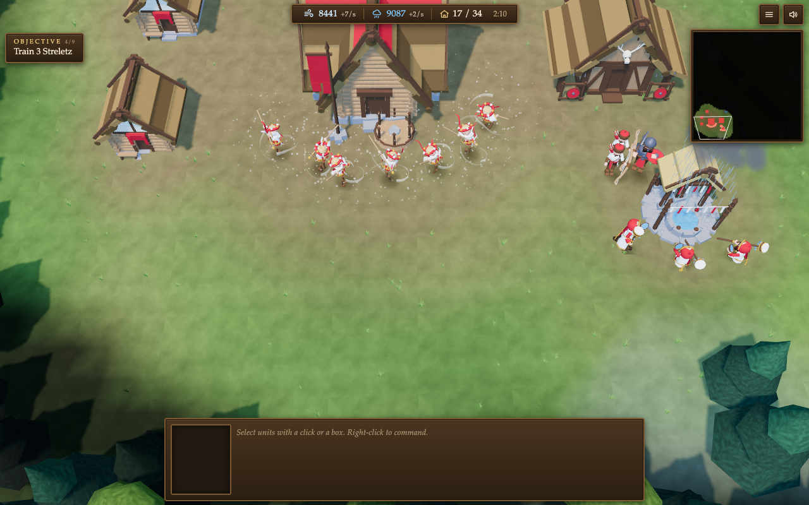
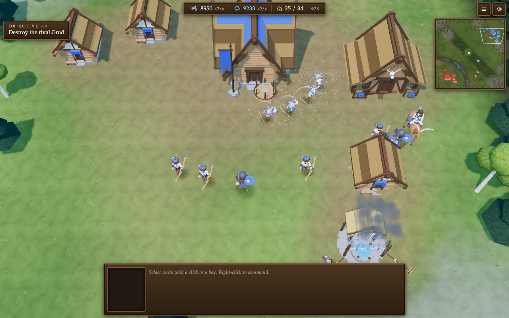
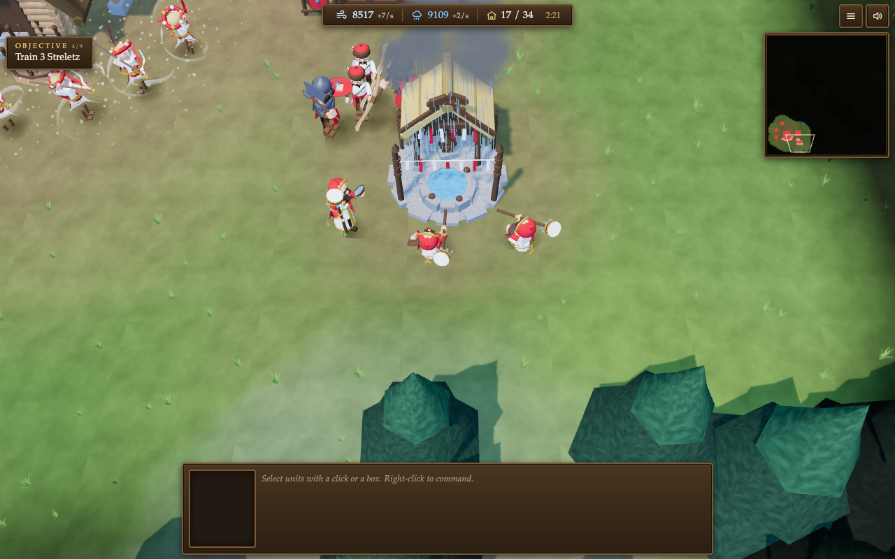
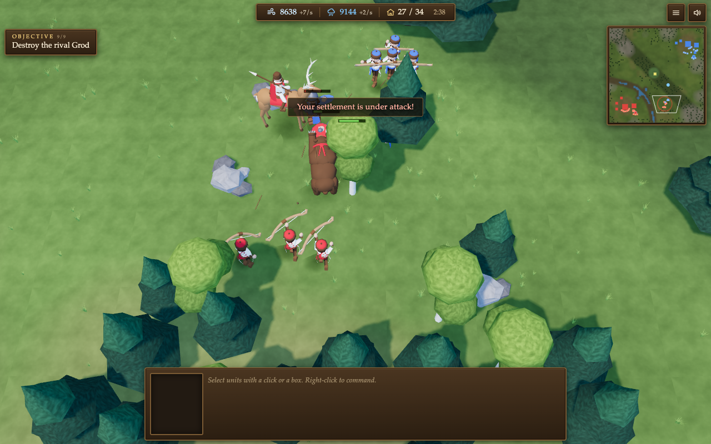
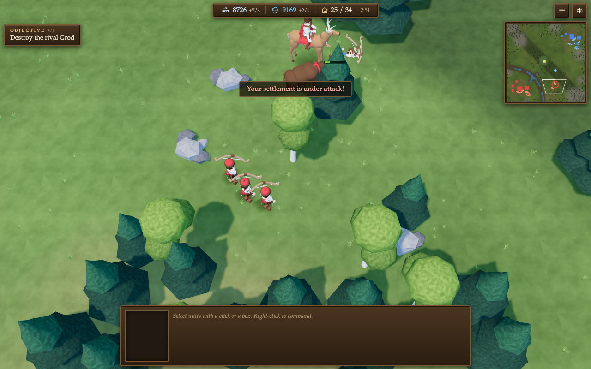
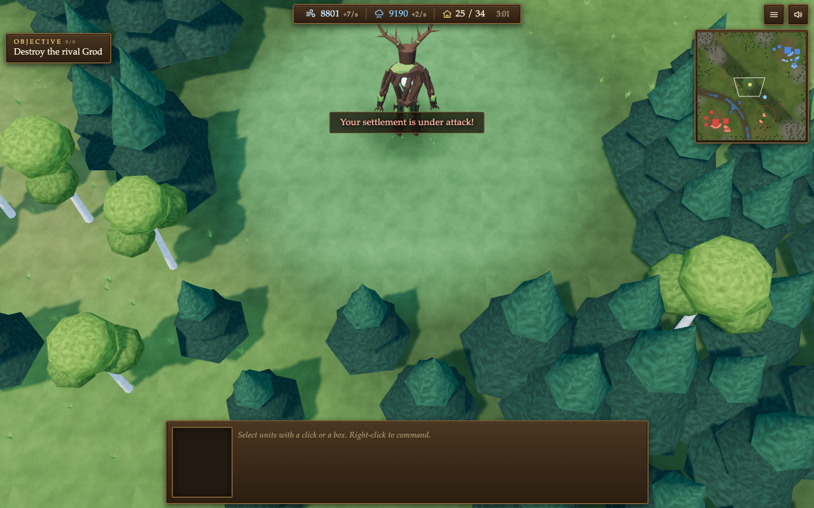
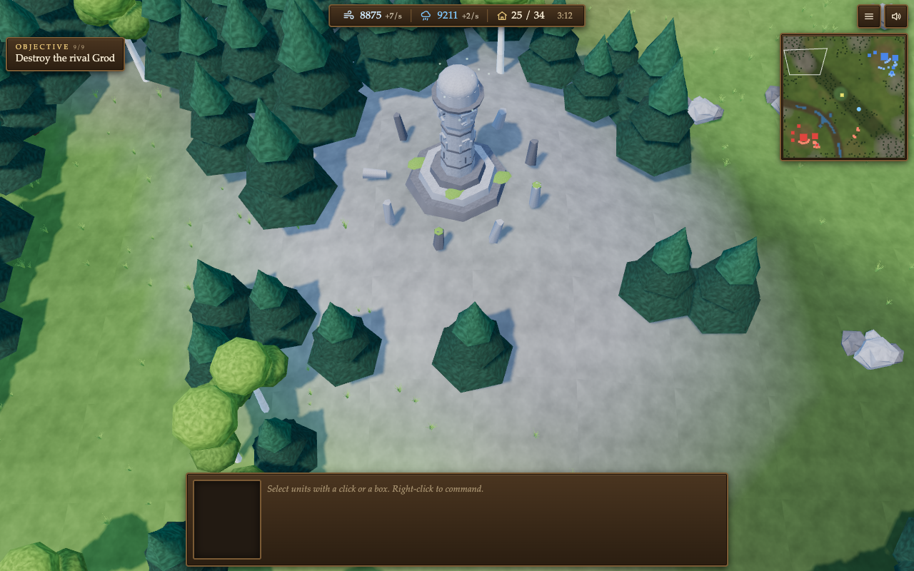

# Wind & Rain

[View source](https://github.com/michalbe/viatr-and-deshch)

| Overall rating | Screenshot score |
| :---: | :---: |
| **51/100** | **58/100** |

Read the scoring rationale

### Overall rating

Excluding the target, closest comparators are OSRS Tower Defense (52, deep strategy systems with verified playable host), Kart Royale (50, complete polished 3D loop but single-track), moorestech (64, broadest verified systems scope) and Ashlands (55, ambitious 3D scope). Wind & Rain exceeds Kart Royale on gameplay depth (full RTS loop: ritual economy, base building, tech progression, scouting, AI raids, fog, neutral boss) and matches OSRS-tier systems ambition in real-time 3D, but sits just below OSRS (52) and well below Ashlands/moorestech because no public playable host is verified (Pages 404, placeholder play URL), the report itself discloses no balance pass and no playtesting, screenshots show only the superseded art pass, and phone performance is unremeasured. Single map, single AI opponent, and 0 stars/0 forks cap it far from AAA.

### Screenshot score

All seven inspected frames are the game's own runtime output with coherent low-poly 3D, shadows, particles, full RTS HUD, objectives and minimap. They sit above sparse flat entries such as Taipo (55) and near THORNMERE/HEX DANMAKU (60) on scene coherence, but below OSRS Tower Defense (65) on texture/UI density and far below moorestech (76) and Kart Royale (70) on detail, lighting richness and polish. Discounted because the status report labels these the previous art pass (current painted rebuild unpictured) and the ground reads flat; stills prove nothing about motion, performance or balance.

## At a glance

| Detail | Value |
| --- | --- |
| Repository created | 26 Sep 2026 · 07:54 UTC |
| Added to catalog | 27 Sep 2026 · 06:13 UTC |
| Last updated | 27 Sep 2026 · 06:13 UTC |
| Documented creation models | [Claude Fable 5.1](https://raw.githubusercontent.com/michalbe/viatr-and-deshch/main/README.md), [Claude Opus 5.5](https://raw.githubusercontent.com/michalbe/viatr-and-deshch/main/README.md) |

## Screenshots

Inspected: top-down 3D RTS village with longhouse-style Grod and Khatas, seven Vietra dancers with white wind-mote particle rings, stone Rain Shrine with rain cloud and splashes and kneeling Zhercas, red/blue clan colours, full HUD (Wind 8441 +7/s, Rain 9087 +2/s, supply 17/34, 2:10 clock, Objective 4/9 Train 3 Streletz, minimap with fog). Densest gameplay evidence; game's own runtime output from the previous art pass.

[Original screenshot](https://raw.githubusercontent.com/michalbe/viatr-and-deshch/main/_critic/01_village_dance.png)

Inspected: rival village with blue-banner Grod, blue-clad dancing Vietras, archers, Vitez with shield, Deer Rider cavalry, and active Rain Shrine with rain FX; minimap shows red/blue territories. Shows enemy-clan readability and village scale; game's own runtime output, previous art pass.

[Original screenshot](https://raw.githubusercontent.com/michalbe/viatr-and-deshch/main/_critic/07_rival_village.png)

Inspected: close view of stone Rain Shrine with pool, rain streaks and dark cloud, three Zhercas with drums/vessels performing the rite, nearby Streletz and Vitez guards; HUD Objective 4/9. Clearest ritual-economy evidence; game's own runtime output, previous art pass.

[Original screenshot](https://raw.githubusercontent.com/michalbe/viatr-and-deshch/main/_critic/02_rain_rite.png)

Inspected: forest skirmish with red archers drawing bows, brown Bear grappling a Deer Rider, blue enemy squad on hill, 'Your settlement is under attack!' banner, Objective 9/9 Destroy the rival Grod, minimap with river and dots. Shows combat, cavalry and beasts; game's own runtime output, previous art pass.

[Original screenshot](https://raw.githubusercontent.com/michalbe/viatr-and-deshch/main/_critic/03_battle.png)

Inspected: aftermath frame with Deer Rider standing over fallen archer and Bear, three red archers advancing through pines and rocks; attack banner and 9/9 objective persist. Sparse combat scene; game's own runtime output, previous art pass.

[Original screenshot](https://raw.githubusercontent.com/michalbe/viatr-and-deshch/main/_critic/04_battle_late.png)

Inspected: tall antlered wooden Forest Spirit guardian standing in a central clearing ringed by pines; attack banner and 9/9 objective visible. Shows neutral-creature scale; game's own runtime output, previous art pass.

[Original screenshot](https://raw.githubusercontent.com/michalbe/viatr-and-deshch/main/_critic/05_spirit_clearing.png)

Inspected: stone idol landmark on a hill clearing surrounded by pines and carved posts; no units or combat, decorative landmark only. Least gameplay-dense frame, ranked last; game's own runtime output, previous art pass.

[Original screenshot](https://raw.githubusercontent.com/michalbe/viatr-and-deshch/main/_critic/06_idol.png)

## Play

- Serve the game/ folder from any static host and open game/index.html (no build step).
- Select with click, drag-box or double-click; command with right-click or Cmd/Ctrl+click; use WASD/arrows/edges/wheel/minimap for camera and Ctrl+1..9 for groups (touch: tap, long-press, camera stick, pinch, BOX/ARMY/IDLE buttons).
- Gather 100 Wind with dancing Vietras, build a Khata, then a War Hall, then train Streletz.
- Build a Rain Shrine at a Sacred Spring, assign Zhercas to gather Rain, then train a Vitez and expand supply.
- Scout the Sacred Valley, clear or avoid the Forest Spirit, find the rival settlement and destroy its Grod while defending your own.

## Mechanics

- Ritual economy: 1 Wind/s per dancing Vietra, 1 Rain/s per Zherca at a shrine; combat interrupts rituals
- Six units (Vietra, Zherca, Streletz, Vitez, Deer Rider, Bear) and five buildings (Grod, Khata, War Hall, Rain Shrine, Sacred Grove) with documented costs and supply
- Construction by ritualist builders with payment on placement, refund on cancel, and growth-phase building
- Production queues (max 5) with cancel refunds and context-aware rally points (dance, rite, attack)
- Grid A\* pathing with separation, group formations and auto-acquire combat with building/ritualist damage multipliers
- Fog of war with unexplored/explored states, terrain minimap with unit dots, and fixed-yaw zoom-tilt camera
- Rival clan AI that gathers, trains, builds Khatas, expands to the exposed spring, defends home and raids from minute five
- Neutral Forest Spirit that guards the central clearing, leashes, heals, splashes, and pays a bounty
- Nine sequential tutorial objectives ending in destroy-the-rival-Grod victory and Grod-loss defeat
- Economy-as-soundtrack: each dancer adds a synthesised rhythm layer; Zhercas add chant, water and thunder

## Tags

- real-time-strategy
- 3d
- base-building
- resource-management
- single-player
- browser
- slavic-mythology

## Controls

- Mobile controls: Supported
- Motion controls: Not established
- Gamepad: Not established
- Keyboard/mouse: Supported

## Player modes

- Human players: 1
- Modes: single-player

## Technologies

- **Three.js 0.169.0** — engine ([evidence](https://raw.githubusercontent.com/michalbe/viatr-and-deshch/main/game/index.html))
- **JavaScript** — language ([evidence](https://raw.githubusercontent.com/michalbe/viatr-and-deshch/main/game/src/config.js))
- **WebAudio** — audio ([evidence](https://raw.githubusercontent.com/michalbe/viatr-and-deshch/main/README.md))
- **Canvas 2D** — rendering ([evidence](https://raw.githubusercontent.com/michalbe/viatr-and-deshch/main/README.md))

## Reconstructed prompt

Build a browser 3D real-time strategy game called Wind & Rain in plain Three.js with no build step: Slavic ritual settlement where dancing Vietras generate Wind and Zhercas at spring shrines generate Rain; six units, five buildings, supply, queues, rally points, fog of war, minimap, tutorial objectives, victory/defeat, a raiding rival-clan AI, a neutral Forest Spirit, code-painted low-poly Warcraft-III-style models, procedural WebAudio ritual soundtrack, full keyboard/mouse plus touch controls, and a model workshop viewer.

## Source evidence

- Repository michalbe/viatr-and-deshch exists and its README titles the project 'Wind & Rain', a 3D real-time strategy game for the browser about a mythological early-medieval Slavic settlement whose economy runs on ritual. ([source](https://github.com/michalbe/viatr-and-deshch))
- Ritual economy documented: Vietras dance to gather Wind, Zhercas perform the rite at Sacred Springs to gather Rain; both fund village and warband to destroy the rival clan's Grod. ([source](https://raw.githubusercontent.com/michalbe/viatr-and-deshch/main/README.md))
- Scope documented: six unit types (Vietra, Zherca, Streletz, Vitez, Deer Rider, Bear), five buildings (Grod, Khata, War Hall, Rain Shrine, Sacred Grove), supply, production queues, rally points, construction, fog of war, minimap, sequential tutorial objectives, victory and defeat. ([source](https://raw.githubusercontent.com/michalbe/viatr-and-deshch/main/README.md))
- Status report states the minimum-viable checklist (all 12 items: start, gather Wind/Rain, build Khata/War Hall/Rain Shrine, train Streletz/Vitez, move army, fight, destroy rival Grod, victory screen) works end to end, with a rival clan AI that gathers, builds, expands and raids from minute five. ([source](https://raw.githubusercontent.com/michalbe/viatr-and-deshch/main/PROTOTYPE-STATUS.md))
- Status report explicitly notes what is missing: no balance pass, no playtesting, no Baba/active rituals/day-night/weather/second map, idol is decoration, no settings/save/pause/difficulty, no automated tests. ([source](https://raw.githubusercontent.com/michalbe/viatr-and-deshch/main/PROTOTYPE-STATUS.md))
- Keyboard/mouse controls documented: click, drag-box, double-click type select, right-click or Cmd/Ctrl+click to command, WASD/arrows/screen edges/wheel/minimap camera, Ctrl+1..9 groups. ([source](https://raw.githubusercontent.com/michalbe/viatr-and-deshch/main/README.md))
- Touch controls documented: tap, double-tap, long-press to command, camera stick, one-finger drag, pinch zoom, minimap, plus BOX / ARMY / IDLE buttons. ([source](https://raw.githubusercontent.com/michalbe/viatr-and-deshch/main/README.md))
- Single-player structure: one map (The Sacred Valley), one opponent (rival clan AI reusing player models with clan colours); no multiplayer or human-opponent mode documented. ([source](https://raw.githubusercontent.com/michalbe/viatr-and-deshch/main/game-design-doc.md))
- Engine pinned by import map: three@0.169.0 via jsdelivr for build/three.module.js and examples/jsm addons; game boots as ES modules from game/src/main.js with no build step. ([source](https://raw.githubusercontent.com/michalbe/viatr-and-deshch/main/game/index.html))
- Audio and art are fully procedural: every texture is painted in code at load time by game/paint.js (no image files); all sound is WebAudio synthesis with no audio files; dancers add layers to a synthesised settlement rhythm. ([source](https://raw.githubusercontent.com/michalbe/viatr-and-deshch/main/README.md))
- No verified public playable host: README only says to open game/index.html from any static host; entry-draft.json play\_url is an unfilled YOUR\_GITHUB\_HANDLE template; https://michalbe.github.io/viatr-and-deshch/game/ returns 404. ([source](https://raw.githubusercontent.com/michalbe/viatr-and-deshch/main/entry-draft.json))
- Seven reference screenshots in \_critic/ show the game's own runtime output, but the status report labels them screenshots of the previous art pass before the Warcraft-III-style rebuild. ([source](https://raw.githubusercontent.com/michalbe/viatr-and-deshch/main/PROTOTYPE-STATUS.md))
- Tools attribution: built with Claude Code (Claude Fable 5.1 and Claude Opus 5.5); no image or sound generators used. ([source](https://raw.githubusercontent.com/michalbe/viatr-and-deshch/main/README.md))
- Catalog check: local games/ directory contains no michalbe or viatr-and-deshch entry, so no existing slug is reused. ([source](https://github.com/michalbe/viatr-and-deshch))

## Fictional reviews

Treat these as illustrative, not real user reviews.

- 82/100: Fictional review: the dancing economy clicked around minute four — hearing my income thicken every time a new Vietra joined the circle is the most original RTS hook I have played in years.
- 55/100: Fictional review: a charming and legible Warcraft-III-style prototype with a real AI raid curve, but the flat ground, unreadable close-ups and untouched balance keep it firmly in promising-jam territory.
- 95/100: Fictional review: ten out of ten, my Bear soloed their Grod while the shrine choir sang — Slavic ritual warfare has never felt this personal.

## Links

- [Source repository](https://github.com/michalbe/viatr-and-deshch)
