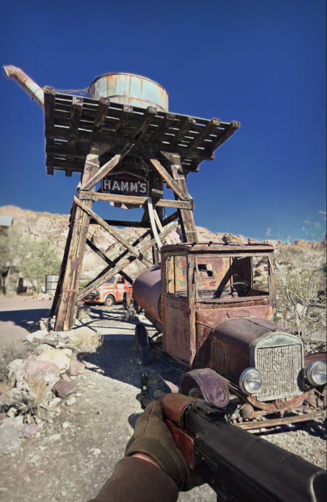
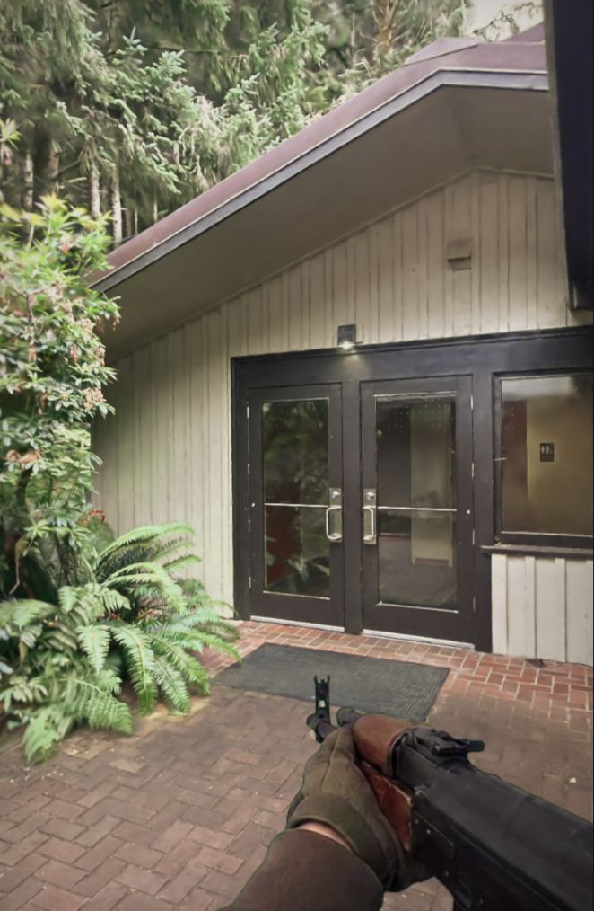
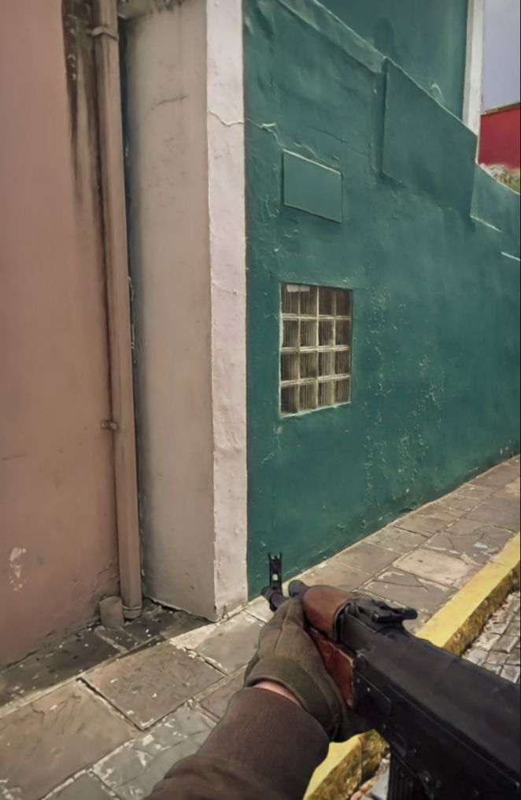

# Neural Sight

[View source](https://github.com/monstercameron/Neural-Sight)

| Overall rating | Screenshot score |
| :---: | :---: |
| **30/100** | **70/100** |

Read the scoring rationale

### Overall rating

Impressive 24-hour technical prototype for photographic static worlds and responsive screen-space weapons, but far from AAA: tiny scope (4 streamed captures, 1 weapon performance, balls + experimental zombies), baked lighting with capture holes, no campaign/progression/multiplayer/economy, and acknowledged continuity and performance tradeoffs. Evidence gaps: no live playtest possible from static analysis alone, no verified frame-rate/GPU cost across devices, no HUD, audio, or full-loop encounter depth visible in screenshots.

### Screenshot score

All three are the game's own output (not concept art) per README. Environments show photographic captured lighting, convincing rust, timber, plaster and foliage with coherent first-person weapon compositing. Deducted for splat softness/smearing on fine edges, empty HUD-less showcase framing, portrait crops, and visible screen-space weapon integration limits versus true geometric 3D.

## At a glance

| Detail | Value |
| --- | --- |
| Documented creation models | Not established |

## Screenshots

First-person in-engine view in desert ghost town: weathered timber water tower with HAMM'S sign, rusted vintage tanker truck and orange car, rocky hills, deep blue sky; gloved hands hold an AK-style rifle low-ready at bottom right; sharp captured sunlight, rust and wood detail with mild splat softness on foliage edges.

[Original screenshot](https://raw.githubusercontent.com/monstercameron/Neural-Sight/main/docs/images/nelson-ghost-town.jpg)

First-person in-engine view outside modern wood visitor building with double glass doors, brick path, black mat, lush ferns and tall evergreens; same gloved hands and AK-style rifle low-ready; soft overcast captured light, clean architectural lines but flatter composition.

[Original screenshot](https://raw.githubusercontent.com/monstercameron/Neural-Sight/main/docs/images/fort-clatsop.jpg)

First-person in-engine view in narrow alley: weathered turquoise plaster wall with glass-block window, beige wall with drainpipe, stone pavers and yellow curb; same gloved hands and AK-style rifle low-ready; strong surface weathering detail but tight framing with less depth than the desert scene.

[Original screenshot](https://raw.githubusercontent.com/monstercameron/Neural-Sight/main/docs/images/san-juan.jpg)

## Play

- Open the live demo in a desktop WebGPU browser with hardware acceleration and choose a level (San Juan, Fort Clatsop, El Romeral, Nelson Ghost Town), then click to capture mouse and enable sound.
- Move with WASD, sprint with Shift, crouch with C or Ctrl, jump with Space; look with mouse.
- Fire with left click, aim with right mouse or X, change fire mode with V, equip or stow with E.
- Tap R to swap magazine, hold R to slowly repack remaining rounds.
- Toss a beach ball with F and shoot it; fight recoil to stay on target.
- Try the experimental zombie encounter; revive defeated zombies with G.
- Pause with Escape, open tools with Tab, return to spawn with ~, reset view/weapon with Home.

## Mechanics

- Free-look first-person movement through streamed Gaussian-splat scenes with voxel-collider ground and ray-hit detection
- Screen-space generated weapon performance with low-ready, ADS, firing, sprint, crouch and reload states plus recoil, camera kick, sway and view bob
- Hitscan ballistics with bullet impacts against splat/voxel world
- Magazine management with fast swap versus slow repack
- Throwable and shootable physics beach balls
- Experimental zombie encounter with combat, melee/contact damage and revive
- Sprint momentum, head-lead, turn-tilt, elastic free-look and recoil compensation
- Cinematic WebGPU post pipeline: color grading, peripheral focus, motion blur, temporal AA, sharpening and scene-based weapon brightness
- Four streamed levels with LOD/splat-budget settings and per-level download cache

## Tags

- fps
- browser
- gaussian-splatting
- photographic
- experimental
- playcanvas
- webgpu
- zombies
- shooter-prototype

## Reconstructed prompt

Build a playable first-person browser FPS in ~24 hours where navigable Gaussian-splat captures from SuperSplat provide photographic static worlds with voxel colliders, AI-generated hand/weapon video frames are composited screen-space and driven by a responsive state machine (hip, ADS, fire, reload, sprint, crouch), rendered in PlayCanvas with a WebGPU cinematic post pipeline, featuring 4 streamed levels, ballistics, throwable balls and a zombie encounter.

## Source evidence

- Title is Neural Sight; described as a first-person browser experiment with Gaussian-splat worlds and generated screen-space weapon footage, built in roughly 24 hours with GPT-6 Astra. ([source](https://github.com/monstercameron/Neural-Sight/blob/main/README.md))
- README states actual in-game captures with HUD hidden; three screenshots show Nelson Ghost Town by tosolini (CC BY 4.0), Fort Clatsop by virtualworldtours, and San Juan by AJ Creek/virtualworldtours, with scene rights remaining with publishers. ([source](https://github.com/monstercameron/Neural-Sight/blob/main/README.md))
- Static world is streamed Gaussian splats preserving photographed appearance; hands/weapon are AI-generated footage extracted to frames and composited in screen space via a state machine (low ready, aiming, firing, running, crouching, reloads). ([source](https://github.com/monstercameron/Neural-Sight/blob/main/README.md))
- Four playable levels are defined in code and streamed from publishers, not bundled: San Juan, Fort Clatsop, El Romeral (Chile), and Nelson Ghost Town, using SuperSplat lod-meta.json plus published voxel colliders for ground contact and bullet hits. ([source](https://github.com/monstercameron/Neural-Sight/blob/main/app/src/levels.js))
- Rendering stack is PlayCanvas 2.22.0 for splats/dynamic objects with a WebGPU compositor doing color grading, peripheral focus, motion blur, temporal antialiasing and sharpening; app source has ~70 modules covering recoil, ballistics, zombie encounter, physics balls, audio and movement. ([source](https://github.com/monstercameron/Neural-Sight/blob/main/app/package.json))
- Gameplay includes sprint, recoil control, magazine swap vs slow repack, throwable/shootable beach balls, and an experimental zombie encounter with revive; live demo requires desktop WebGPU browser and loads ~59 MiB production media in three ZIP packs cached in browser. ([source](https://monstercameron.github.io/Neural-Sight/experiment.html))
- Controls are WASD/Shift move/sprint, mouse look/fire, right-mouse/X aim, C/Ctrl crouch, Space jump, tap/hold R swap/repack, V fire mode, E equip/stow, F toss ball, G revive zombies, Esc/Tab pause/tools, ~/Home spawn reset. ([source](https://github.com/monstercameron/Neural-Sight/blob/main/README.md))
- Project thesis page disclaims this is not a finished shooter nor proof splats outperform rasterization/path tracing; captures have holes and baked lighting, generated frames cannot supply arbitrary weapon viewpoints, and film-look ledger records 8 review cycles not 50. ([source](https://monstercameron.github.io/Neural-Sight/experiment.html))

## Fictional reviews

Treat these as illustrative, not real user reviews.

- 80/100: Fictional reviewer: Walked under that ghost-town water tower and just stared at the rust for a minute — the light feels stolen from real life. Then I remembered I could actually shoot beach balls off the truck. Jank? Sure. Magic? Also yes.
- 60/100: Fictional reviewer: The world looks amazing until you strafe and the ferns smear like wet paint. Gun feels punchy though, and repacking mags mid-fight is weirdly tense. A brilliant museum that wants to be an arena.
- 100/100: Fictional reviewer: I loaded San Juan to test the tech and stayed to hunt zombies in an alley that smells like rain even through the screen. As a 24-hour dare, this is absurdly playable — I want the full heist version.

## Links

- [Related link](https://monstercameron.github.io/Neural-Sight/)
- [Related link](https://monstercameron.github.io/Neural-Sight/experiment.html)
- [Related link](https://github.com/monstercameron/Neural-Sight/blob/main/README.md)
- [Related link](https://superspl.at/)
- [Source repository](https://github.com/monstercameron/Neural-Sight)
