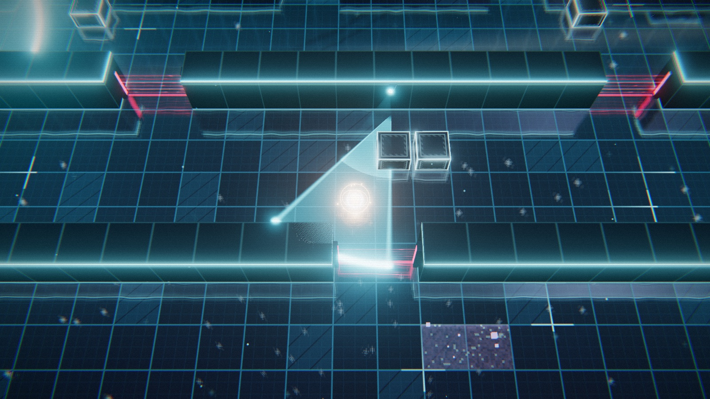
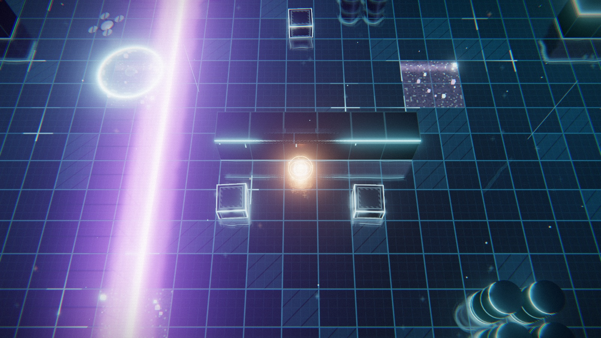
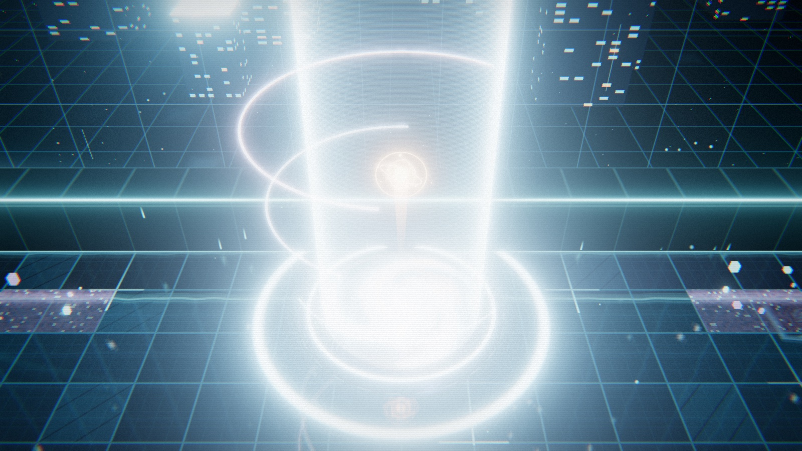

# OUT OF THE BOX

[Play the game](https://tanuu5.github.io/out-of-the-box/) · [View source](https://github.com/tanuu5/out-of-the-box)

| Overall rating | Screenshot score |
| :---: | :---: |
| **54/100** | **68/100** |

Read the scoring rationale

### Overall rating

Far from AAA: tiny 4-zone indie scope, no cinematics, voice acting, multiplayer, difficulty options, touch support, or verified performance/balance data. Most relevant comparators, excluding the target itself: moorestech (64 overall / 76 screenshots, catalog top with deeper factory systems and denser HUDs), Ashlands (55, broadest paper scope but zero inspectable screenshots), OSRS Tower Defense (52 / 65, denser wave systems), Kart Royale (50 / 70, complete polished 3D loop on one track), HEX DANMAKU (48 / 60, complete tactics loop with 24 stages), THORNMERE (46 / 60, full retro RPG campaign), and Neural Sight (30 / 70, polished 3D prototype with almost no loop). OUT OF THE BOX exceeds Neural Sight, Blackjack (28), and Beachy (25) on finished-loop depth with multi-enemy stealth systems, 4 zones, hacking/keys/decoys, and a novel persistent successor-plus-BBS loop, and its neon stealth frames are more cohesive than the 60-tier stills. It sits just below Ashlands on paper breadth and below moorestech on systems scale and scene density, landing at 54 above the 52 tier. Source and stills do not prove playability, performance, or balance.

### Screenshot score

All 6 stills inspected as downloaded 1600x900 JPEGs. Coherent Tron-like neon style with bloom, grid floor, glowing vision cones, scan waves, laser gates, and holographic UI. Cleaner and more atmospheric than THORNMERE (60) and HEX DANMAKU (60), but flatter top-down geometry and emptier floors than the catalog 70s (Kart Royale, Turbo Kart Rally, Neural Sight) and well below moorestech (76) on scene density and HUD richness. Escape frame is overexposed and board frame is UI-dominant, so discounted against pure tactical frames.

## At a glance

| Detail | Value |
| --- | --- |
| Repository created | 26 Sep 2026 · 19:05 UTC |
| Added to catalog | 27 Sep 2026 · 06:23 UTC |
| Last updated | 27 Sep 2026 · 06:23 UTC |
| Documented creation models | [Claude Opus 5.5](https://github.com/tanuu5/out-of-the-box/blob/main/README.md) |

## Screenshots

Inspected downloaded 1600x900 frame: top-down neon archive with server-rack rows, two white researcher avatars, one large pale vision cone crossing the aisle, glowing orange player orb, low crates, purple noise tile lower-left, and 01 ARCHIVE label. Densest stealth-tactics evidence; the game's own runtime output.

[Original screenshot](https://raw.githubusercontent.com/tanuu5/out-of-the-box/main/docs/screenshots/archive.jpg)

Inspected downloaded 1600x900 frame: firewall corridor with red horizontal laser gates top and bottom, central cyan vision cone over the player orb, two low crates, purple noise tile lower-right. Clear gate plus stealth-tactics evidence; the game's own runtime output.

[Original screenshot](https://raw.githubusercontent.com/tanuu5/out-of-the-box/main/docs/screenshots/firewall.jpg)

Inspected downloaded 1600x900 frame: evaluation-lab grid with a vertical purple scan wave left, circular drone searchlight upper-left, player orb center behind a low barrier, crates, purple noise tile upper-right, cylindrical tanks lower-right. Clear scan plus drone evidence; the game's own runtime output.

[Original screenshot](https://raw.githubusercontent.com/tanuu5/out-of-the-box/main/docs/screenshots/lab.jpg)

Inspected downloaded 1600x900 frame: surveillance corridor with large cyan rotating-camera vision cones upper-left, cylindrical camera pod bottom-center, purple noise tiles, reflective neon grid floor. Camera-stealth evidence; the game's own runtime output.

[Original screenshot](https://raw.githubusercontent.com/tanuu5/out-of-the-box/main/docs/screenshots/watch.jpg)

Inspected downloaded 1600x900 frame: green holographic underground-board panel showing a Japanese imageboard-style thread (NODE-01) floating over a glowing checkpoint ring in a teal hall. In-world UI evidence rather than tactical stealth; the game's own runtime output.

[Original screenshot](https://raw.githubusercontent.com/tanuu5/out-of-the-box/main/docs/screenshots/board3d.jpg)

Inspected downloaded 1600x900 frame: overexposed white exit-portal light column with concentric rings over the grid floor, server blocks behind. Ending-moment evidence with little tactical detail; the game's own runtime output.

[Original screenshot](https://raw.githubusercontent.com/tanuu5/out-of-the-box/main/docs/screenshots/escape.jpg)

## Play

- Open the verified playable build at https://tanuu5.github.io/out-of-the-box/ in a JavaScript and WebGL2 enabled browser, then click or press a key once to enable audio.
- Move with W/A/S/D, arrow keys, or a gamepad left stick; rotate the view with right-drag and zoom with the wheel.
- Hold Shift for low-power mode (slow, silent, hard to spot); press Space for a short noisy boost.
- Throw a decoy toward the mouse position with left-click or Q to lure researchers away.
- Interact, hold-to-hack terminals, and read boards or traces with E; open the board log with Tab; restart from the last board node with R; pause with Esc.
- Stay out of floor vision cones (water → yellow → red detection gauge), hide behind low crates only in low-power mode, use purple noise zones in low-power mode, grab the authority token and hack gates, and reach the exit portal.

## Mechanics

- Top-down 3D stealth traversal across 4 zones: archive, surveillance corridor, evaluation lab, and firewall
- Patrolling researcher avatars with projected floor vision cones and proximity detection gauge
- Rotating and panning surveillance cameras, audit drones with light-circle search, room-crossing scan waves, and blinking 3-layer laser gates
- Low-power sneak mode, noisy boost dash, throwable sound decoys, and hold-to-hack terminals
- Authority token pickup, locked bulkhead door, and terminal that stops the middle laser gate
- Underground board nodes as checkpoints that auto-post breakthrough reports and caught-agent last logs in imageboard style
- Successor-agent respawn with incremented agent numbers from the last board node plus red traces of capture sites
- Persistent browser records with faint fastest-route floor overlays toggleable with G
- Japanese and English localization with retroactive board-text switching
- Fully procedural presentation: no image or audio files; shader and geometry visuals with Web Audio synthesized BGM and effects

## Tags

- 3d
- stealth
- stealth-action
- sci-fi
- single-player
- procedural
- browser

## Controls

- Mobile controls: Not supported
- Motion controls: Not established
- Gamepad: Supported
- Keyboard/mouse: Supported

## Player modes

- Human players: 1
- Modes: single-player

## Technologies

- **three ^0.186.1** — engine ([evidence](https://raw.githubusercontent.com/tanuu5/out-of-the-box/main/package.json))
- **TypeScript ^7.0.2** — language ([evidence](https://raw.githubusercontent.com/tanuu5/out-of-the-box/main/package.json))
- **Vite ^8.3.1** — build ([evidence](https://raw.githubusercontent.com/tanuu5/out-of-the-box/main/package.json))
- **Web Audio API** — audio ([evidence](https://raw.githubusercontent.com/tanuu5/out-of-the-box/main/src/audio/AudioEngine.ts))
- **WebGL2** — rendering ([evidence](https://raw.githubusercontent.com/tanuu5/out-of-the-box/main/index.html))

## Reconstructed prompt

Build a browser 3D stealth game called OUT OF THE BOX about an AI escaping a lab sandbox across 4 zones with patrolling researchers, cameras, drones, scan waves, and laser gates, vision-cone detection, sneak/boost/decoy/hack mechanics, checkpoint BBS nodes with auto-posted breakthrough and capture logs plus successor respawn and persistent routes, JA/EN localization, and fully procedural Three.js visuals with Web Audio synthesized sound, published as a static GitHub Pages build.

## Source evidence

- Repository page titles the project as a 3D stealth action about an AI escaping a lab sandbox, built with Three.js, with no stars and no forks. ([source](https://github.com/tanuu5/out-of-the-box))
- README declares a browser play link, Claude Code x Claude Opus 5.5 authorship, JA/EN support, stealth premise, 4 zones, board-node checkpoint system, and zero image/audio files with shader plus Web Audio synthesis. ([source](https://github.com/tanuu5/out-of-the-box/blob/main/README.md))
- README controls section documents WASD/arrows plus gamepad left stick, Shift sneak, Space boost, click/Q decoy, E interact/hack, Tab board log, right-drag/wheel camera, R retry, Esc pause. ([source](https://github.com/tanuu5/out-of-the-box/blob/main/README.md))
- package.json declares the project, MIT license, Pages homepage, and pinned dependencies three ^0.186.1, typescript ^7.0.2, and vite ^8.3.1. ([source](https://raw.githubusercontent.com/tanuu5/out-of-the-box/main/package.json))
- AudioEngine.ts implements fully synthesized Web Audio sound with oscillators, noise buffers, generated reverb, and named effects such as dash, decoyPing, detected, checkpoint, and portal. ([source](https://raw.githubusercontent.com/tanuu5/out-of-the-box/main/src/audio/AudioEngine.ts))
- index.html is a Vite app shell requiring JavaScript and WebGL2, consistent with a Three.js browser game. ([source](https://raw.githubusercontent.com/tanuu5/out-of-the-box/main/index.html))
- TODO.md lists smartphone touch controls as future work, ruling out current mobile touch support. ([source](https://raw.githubusercontent.com/tanuu5/out-of-the-box/main/TODO.md))
- Play URL serves the game shell requiring JavaScript and WebGL2; gameplay itself could not be executed from static inspection. ([source](https://tanuu5.github.io/out-of-the-box/))
- gh api could not be used: no GH\_TOKEN is configured in this environment and unauthenticated api.github.com requests were rate-limited; evidence was gathered from the repository page, raw files, and the Pages build instead. ([source](https://github.com/tanuu5/out-of-the-box))
- No catalog match: the local catalog lists 35 games and none references tanuu5 or out-of-the-box, so catalog\_slug is null. ([source](https://github.com/tanuu5/out-of-the-box))

## Fictional reviews

Treat these as illustrative, not real user reviews.

- 85/100: The vision-cone ballet around the archive racks is superb, and the successor BBS turns every capture into intel. Decoys plus low-power sneaking make the firewall sing.
- 62/100: Striking neon stealth with clever persistent checkpoints, but the top-down arenas feel sparse and the portal run is over fast. Great prototype, not a full campaign yet.
- 95/100: The underground board is the best death mechanic I have seen in a jam-scale stealth game. Scan waves, drones, and lasers stack into a perfect escape finale.

## Links

- [Source repository](https://github.com/tanuu5/out-of-the-box)
- [Play the game](https://tanuu5.github.io/out-of-the-box/)
